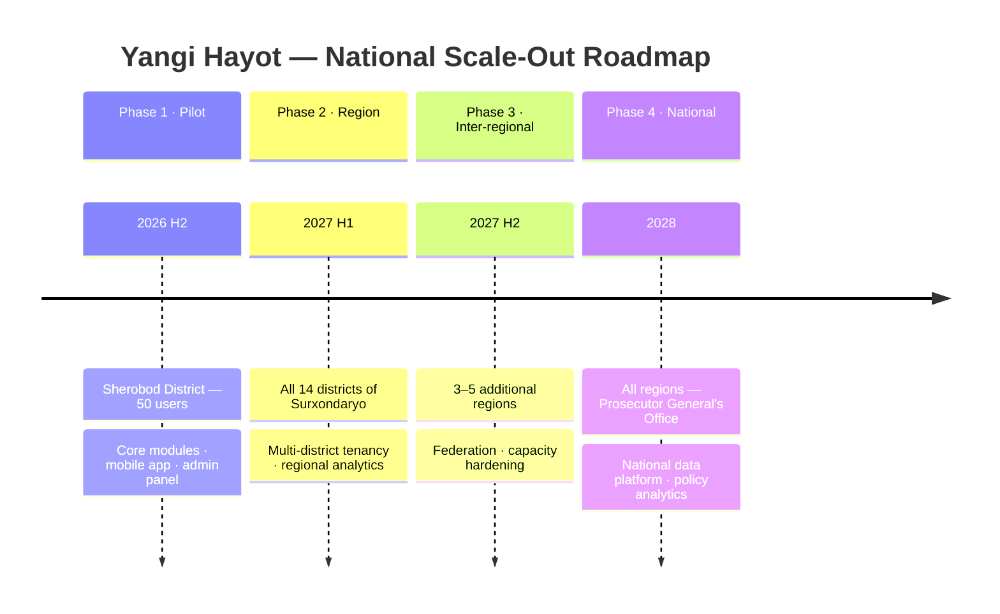

# Yangi Hayot — Digital Rehabilitation & Reintegration Ecosystem

> **"Yangi Hayot"** *(New Life)* — Ijtimoiy reabilitatsiya va reintegratsiya raqamli platformasi

**Pilot Project** — Sherobod District Prosecutor's Office, Surxondaryo Region, Republic of Uzbekistan

---

## 1. Executive Summary

Yangi Hayot is a **human-centered rehabilitation and reintegration platform** for citizens under
probation supervision. It is explicitly **not** a prison-management or surveillance system: its
purpose is to help people rebuild their lives — find work, learn professions, strengthen mental
well-being, form positive habits, and successfully return to society — while giving the
Prosecutor's Office transparent, evidence-based insight into rehabilitation progress.

| Parameter | Value |
|---|---|
| Pilot authority | Sherobod District Prosecutor's Office |
| Oversight | Surxondaryo Regional Prosecutor's Office |
| Phase 1 population | ~50 probation users |
| Phase 1 duration | 6 months pilot + 3 months evaluation |
| Scale-out path | District → all Surxondaryo districts → all regions → national (Prosecutor General's Office) |
| Data residency | Republic of Uzbekistan (government cloud / UzCloud) |
| Languages | Uzbek (Latin & Cyrillic), Russian, Karakalpak (roadmap) |

## 2. Mission Objectives

The platform helps probation users to:

1. **Find employment** — verified job center, CV builder, employer partnerships
2. **Learn new professions** — courses from accredited training centers, certifications
3. **Improve mental well-being** — mood tracking, psychologist sessions, crisis support
4. **Build positive habits** — habit tracker, streaks, daily structure
5. **Read books** — curated digital library with progress tracking
6. **Listen to motivational content** — audiobooks, podcasts, motivational videos
7. **Communicate with mentors** — secure, moderated chat and video sessions
8. **Receive psychological support** — scheduled and on-demand professional help
9. **Track progress** — goals, achievements, milestones, rehabilitation score
10. **Reintegrate into society** — structured journey from supervision to independence

## 3. Role Model (10 Roles)

| # | Role | Scope | Primary purpose |
|---|------|-------|-----------------|
| 1 | Super Administrator | National | Platform operation, configuration, role management |
| 2 | Regional Prosecutor (Surxondaryo) | Region | Regional oversight, aggregated analytics, policy |
| 3 | District Prosecutor (Sherobod) | District | District supervision, approvals, reporting |
| 4 | Probation Officer | Assigned caseload | Case management, tasks, meetings, risk review |
| 5 | Psychologist | Assigned users | Mental-health sessions, assessments, crisis response |
| 6 | Mentor | Assigned users | Guidance, motivation, chat, goal support |
| 7 | Employer | Own vacancies | Post jobs, review candidates, confirm employment |
| 8 | Training Center | Own courses | Publish courses, track learners, issue certificates |
| 9 | User (Probationer) | Self | Full self-service rehabilitation toolkit |
| 10 | Family Member | Linked user, limited | View agreed progress, receive encouragement prompts |

## 4. Architecture Documentation Index

| Document | Diagrams covered |
|---|---|
| [01 — Executive Architecture](docs/01-executive-architecture.md) | Executive Overview · Government Organization Flow · User Journey |
| [02 — System Architecture](docs/02-system-architecture.md) | System Architecture · Microservices · Cloud Infrastructure · Data Flow · API Architecture · Folder Structure |
| [03 — Data Architecture](docs/03-data-architecture.md) | Database ER Diagram |
| [04 — Security Architecture](docs/04-security-architecture.md) | Authentication · Permission Matrix · Security Layers · Audit Log · Backup Strategy · Disaster Recovery |
| [05 — Platform Services](docs/05-platform-services.md) | AI Assistant · Notification Flow · Communication Flow · Chat System · Calendar |
| [06 — Rehabilitation Modules](docs/06-rehabilitation-modules.md) | Employment · Education · Digital Library · Goal Tracking · Mental Health |
| [07 — Applications & Analytics](docs/07-applications-analytics.md) | Analytics Dashboard · Mobile App Flow · Web Admin Flow · Reporting System |

## 5. Technology Baseline

| Layer | Technology | Rationale |
|---|---|---|
| Mobile app | Flutter (iOS + Android) | Single codebase, offline-first, low-end device support |
| Web admin | React + TypeScript (Next.js) | Enterprise dashboard ecosystem, SSR for gov networks |
| API gateway | Kong / NGINX Ingress | Rate limiting, OIDC enforcement, versioning |
| Backend services | NestJS (Node.js, TypeScript) microservices | Rapid delivery, strong typing, gRPC + REST |
| Identity | Keycloak (OIDC/OAuth 2.1) + **OneID** (national e-ID) | Government SSO alignment, MFA |
| Relational data | PostgreSQL 16 (per-service schemas) | ACID, row-level security, mature tooling |
| Cache / realtime | Redis | Sessions, presence, leaderboards, queues |
| Search | OpenSearch | Jobs, courses, library full-text search |
| Object storage | MinIO (S3-compatible, in-country) | Books, audio, video, documents |
| Events | Apache Kafka | Audit stream, notifications, analytics ingestion |
| AI layer | LLM gateway + RAG (pgvector) with human-in-the-loop guardrails | Safe assistant, Uzbek-language support |
| Infrastructure | Kubernetes on UzCloud / government cloud, Tashkent region + DR site | Data sovereignty, horizontal scale |
| Observability | Prometheus · Grafana · Loki · OpenTelemetry | SLO-driven operations |

## 6. Scale-Out Roadmap

## 7. Design Principles

1. **Dignity first** — the user is a citizen rebuilding a life, not an inmate; language, UX and data model reflect this.
2. **Least privilege** — every role sees only its jurisdiction and caseload (row-level security by district/region).
3. **Scale by tenancy, not rewrite** — district is the tenancy unit from day one; adding a district is configuration, not code.
4. **Evidence over opinion** — prosecutors see measurable rehabilitation indicators, not raw surveillance data.
5. **Human-in-the-loop AI** — the AI assistant motivates and informs; it never makes legal or clinical decisions.
6. **Sovereign by default** — all data stored and processed inside the Republic of Uzbekistan.
