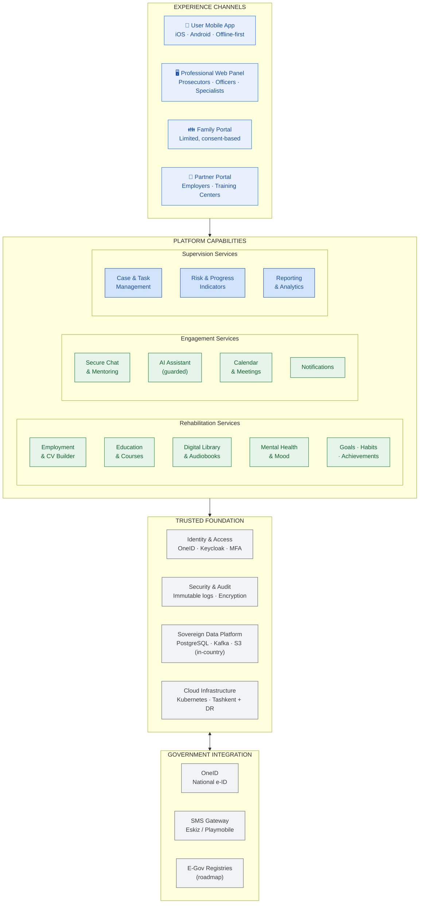
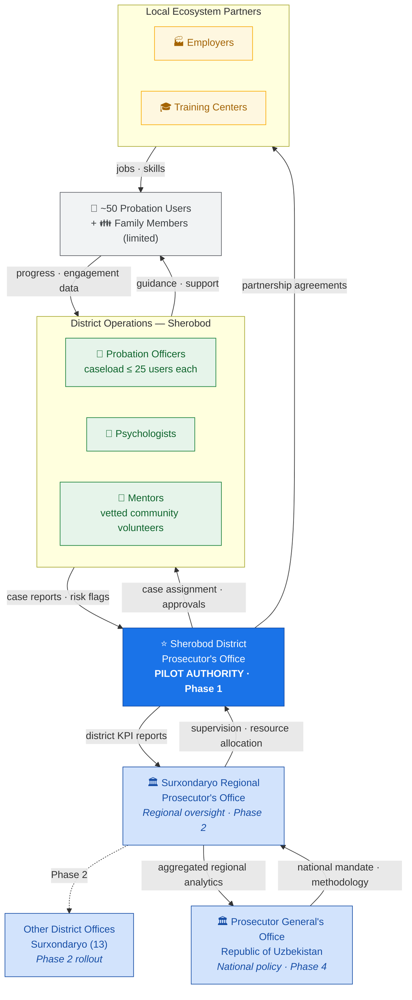
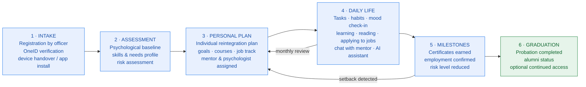
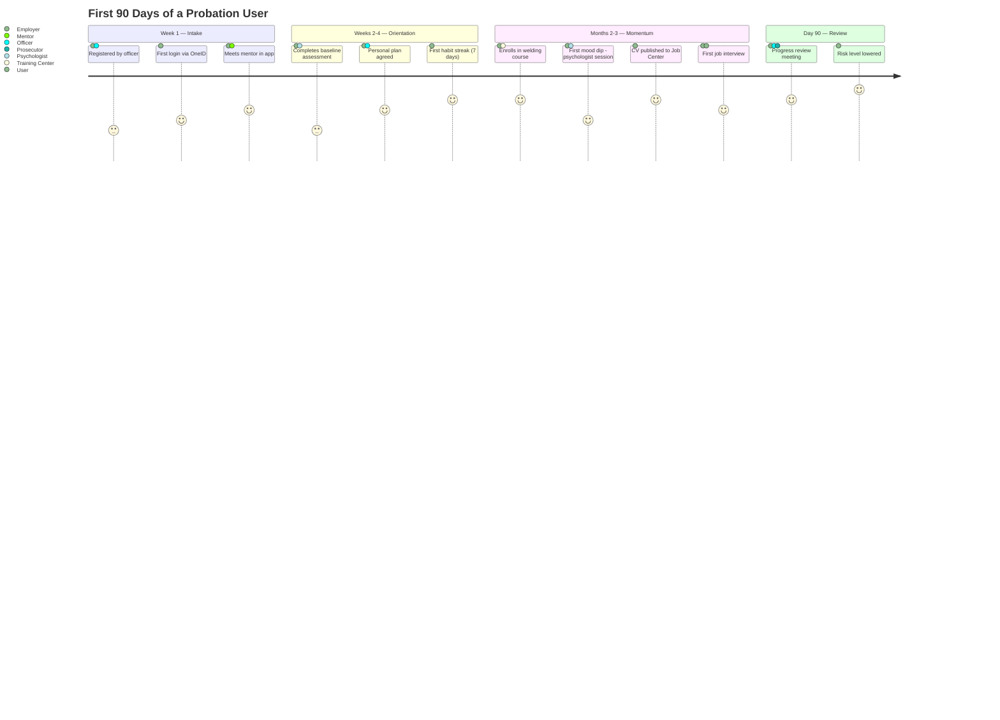
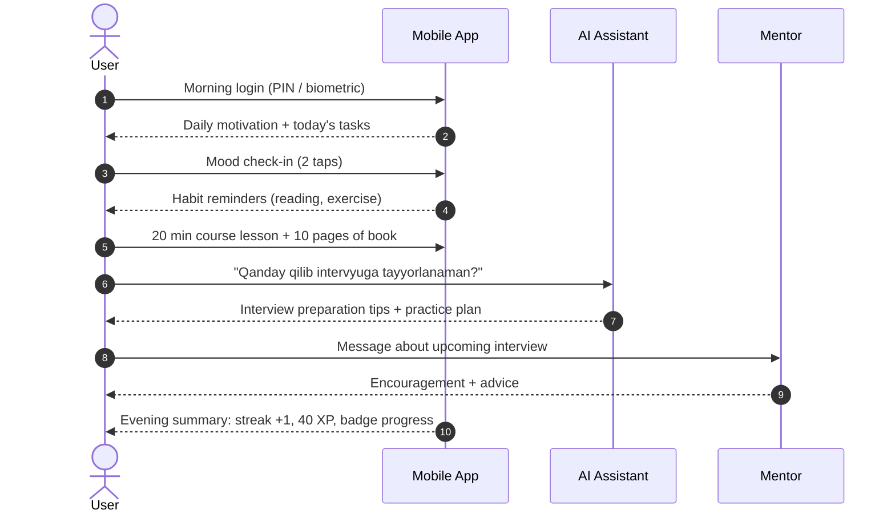

# 01 — Executive Architecture

Audience: District Prosecutor, Regional Prosecutor, Prosecutor General's Office, project sponsors.

---

## 1. Executive Architecture Overview

One page, one story: **citizens engage through human-centered applications; professionals
supervise through governed workspaces; the state receives evidence, not surveillance.**

**Key executive messages**

1. Every capability serves one KPI: **successful reintegration rate**.
2. Supervision consumes *outcomes* (progress, risk, attendance) — not private content.
3. The foundation is sovereign, auditable, and reusable nationally without redesign.

---

## 2. Government Organization Flow

Jurisdictional hierarchy and how oversight information flows upward while mandates flow downward.
The pilot node (Sherobod) is highlighted.

**Reporting cadence**

| Flow | Frequency | Artifact |
|---|---|---|
| Officer → District Prosecutor | Weekly | Caseload status, risk flags |
| District → Regional | Monthly | District KPI report (auto-generated) |
| Regional → Prosecutor General | Quarterly | Regional reintegration analytics |

---

## 3. User Journey — From Supervision to Independence

### 3.1 Rehabilitation lifecycle

### 3.2 Emotional journey (first 90 days)

### 3.3 A day in the app

