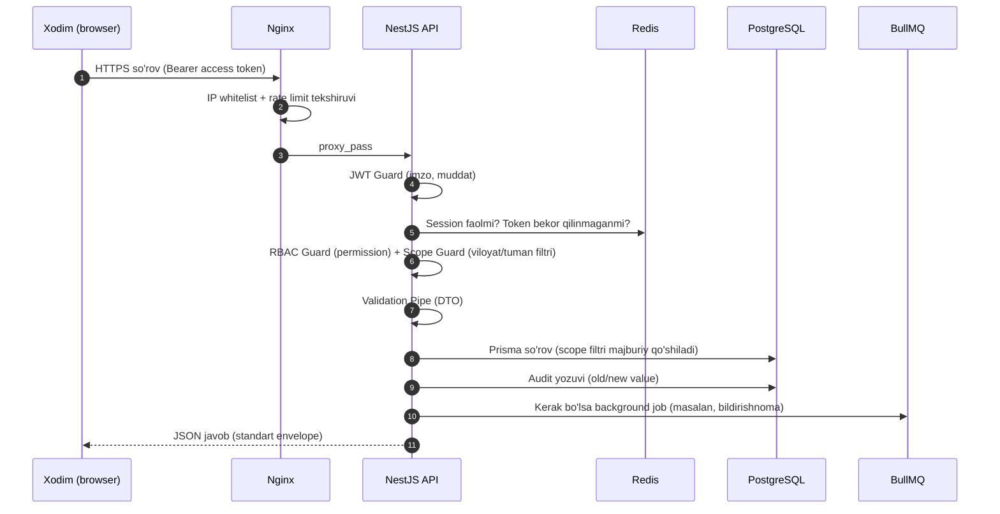
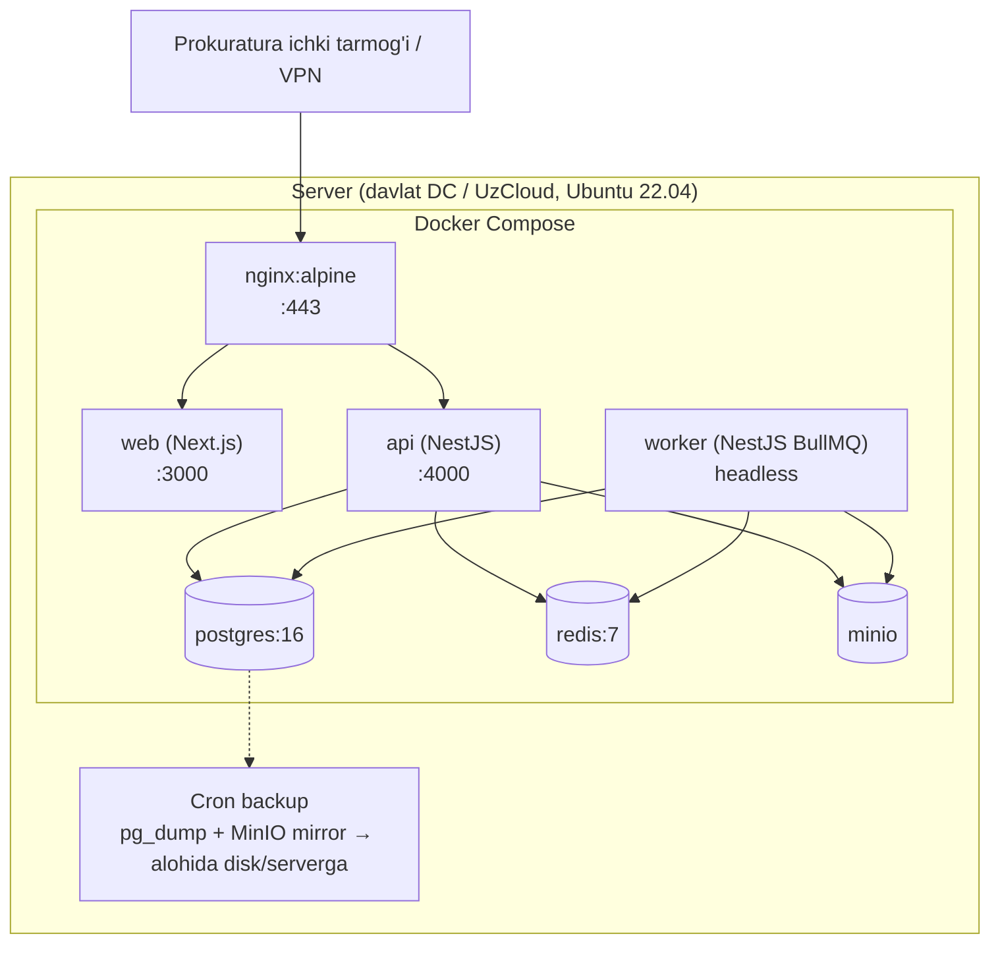
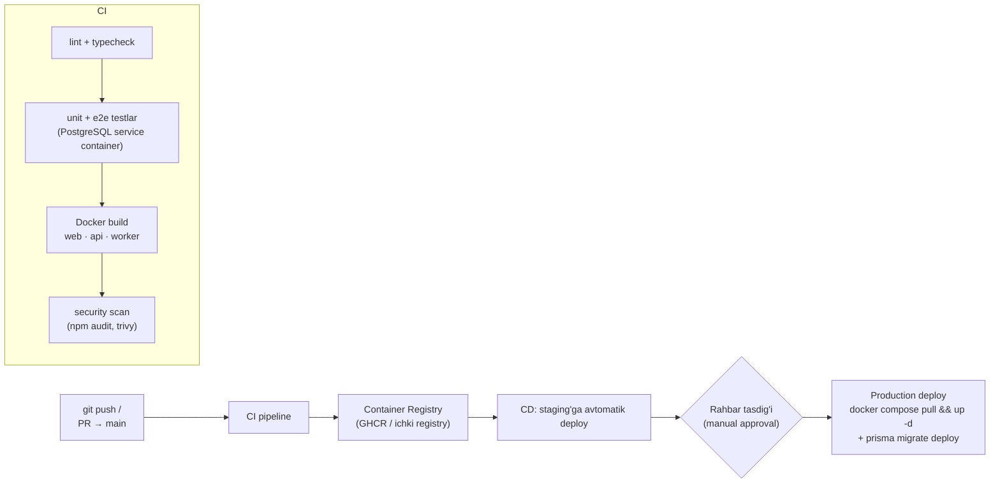

# 01 — System Architecture

To'liq tizim arxitekturasi va deployment arxitekturasi.

---

## 1. Umumiy arxitektura ko'rinishi

Tizim **modulli monolit** (modular monolith) sifatida quriladi: bitta NestJS backend, ichida qat'iy chegaralangan domen modullari. Bu enterprise talablarga javob beradi, lekin pilot va milliy masshtab orasida murakkab microservice operatsion yukini talab qilmaydi. Kafka/microservice'ga o'tish keyingi bosqich uchun ochiq qoldiriladi (modul chegaralari saqlangani uchun ajratish oson).

```mermaid
flowchart TB
    subgraph CLIENT["FOYDALANUVCHILAR (faqat prokuratura xodimlari)"]
        direction LR
        WEB["🖥️ Web Panel<br/>Next.js (SSR)"] ~~~ TV["📺 Monitoring Center<br/>Katta ekran rejimi"]
    end

    subgraph EDGE["EDGE QATLAM"]
        NGINX["Nginx<br/>TLS termination · Reverse proxy<br/>Rate limiting · IP Whitelist · gzip"]
    end

    subgraph APP["APPLICATION QATLAM — NestJS (modular monolith)"]
        direction TB
        subgraph API_L["API Layer"]
            direction LR
            REST["REST API v1<br/>/api/v1/*"] ~~~ WS["WebSocket Gateway<br/>real-time dashboard"] ~~~ SWAG["Swagger<br/>/api/docs"]
        end
        subgraph GUARD["Cross-cutting"]
            direction LR
            AUTHG["JWT Guard"] ~~~ RBACG["RBAC / Scope Guard"] ~~~ AUDITI["Audit Interceptor"] ~~~ VALID["Validation Pipe (Zod/class-validator)"]
        end
        subgraph DOMAIN["Domen modullari"]
            direction LR
            PERS["Persons"] ~~~ PROB["Problems"] ~~~ TASKS["Tasks"] ~~~ VIS["Visits"] ~~~ DOCS["Documents"]
        end
        subgraph DOMAIN2[" "]
            direction LR
            DASH["Dashboard/Analytics"] ~~~ KPIM["KPI"] ~~~ NOTIF["Notifications"] ~~~ AIM["Smart AI"] ~~~ AUD["Audit"]
        end
        subgraph PLATFORM["Platforma modullari"]
            direction LR
            AUTH["Auth (JWT·2FA)"] ~~~ USERS["Users/Roles"] ~~~ GEO["Geo (hududlar)"] ~~~ FILES["Files"] ~~~ EXCEL["Excel Import/Export"] ~~~ SETT["Settings"]
        end
    end

    subgraph WORKER["BACKGROUND WORKERS — BullMQ"]
        direction LR
        Q1["notifications queue"] ~~~ Q2["reminders queue"] ~~~ Q3["excel queue"] ~~~ Q4["ai queue"] ~~~ Q5["backup queue"]
    end

    subgraph DATA["DATA QATLAM"]
        direction LR
        PG[("PostgreSQL 16<br/>asosiy baza")] ~~~ RD[("Redis 7<br/>cache · session · pub/sub · queues")] ~~~ S3[("MinIO<br/>fayllar · rasmlar · media")]
    end

    subgraph EXT["TASHQI XIZMATLAR"]
        direction LR
        TG["Telegram Bot API"] ~~~ SMS["SMS Gateway<br/>(Eskiz/Playmobile)"] ~~~ MAIL["SMTP"] ~~~ YMAP["Yandex Maps API"] ~~~ LLM["LLM Provider<br/>(AI moduli)"]
    end

    CLIENT --> NGINX --> APP
    APP --> DATA
    APP -->|"job qo'shish"| WORKER
    WORKER --> DATA
    WORKER --> EXT
    APP --> EXT
```

## 2. Komponentlar va mas'uliyatlar

| Komponent | Mas'uliyat |
|---|---|
| **Nginx** | TLS, reverse proxy, statik fayl cache, rate limiting (birinchi qatlam), IP whitelist (tarmoq darajasi), WebSocket upgrade |
| **Next.js (web)** | SSR/CSR UI, autentifikatsiya oqimi, ECharts/Yandex Maps render, faqat API orqali ma'lumot oladi |
| **NestJS API** | Biznes logika, RBAC, validation, audit, REST + WebSocket |
| **BullMQ workers** | Bildirishnomalar, eslatmalar (cron), Excel import/export, AI hisobotlar, backup — asosiy so'rov oqimini bloklamaydi |
| **PostgreSQL** | Yagona haqiqat manbai (source of truth). Normalizatsiya, FK, index, soft delete, audit jadvallar |
| **Redis** | Session/refresh token store, permission cache, dashboard cache, WebSocket pub/sub, BullMQ backend |
| **MinIO** | Barcha fayllar (hujjat, rasm, audio, video). Private bucket + presigned URL |

## 3. So'rov hayot sikli (request lifecycle)

## 4. Real-time arxitektura

- **WebSocket Gateway** (`/ws`, socket.io) — Dashboard va Monitoring Center uchun.
- Redis pub/sub orqali barcha API instansiyalari o'rtasida event tarqatiladi (horizontal scale uchun tayyor).
- Kanallar: `dashboard:{scopeId}`, `notifications:{userId}`, `monitoring-center`.
- Fallback: WebSocket ishlamasa TanStack Query 30s polling.

## 5. Deployment Architecture

### 5.1 Bitta server (pilot) — Docker Compose

### 5.2 Masshtab (viloyat/respublika bosqichi)

| O'zgarish | Tavsif |
|---|---|
| API replikatsiya | `api` konteyneri N nusxa, Nginx upstream load-balancing (Redis'dagi session tufayli stateless) |
| PostgreSQL | Primary + streaming replica (read replica analitika uchun), PgBouncer connection pooling |
| Redis | Sentinel yoki managed Redis |
| MinIO | Distributed mode (4+ node, erasure coding) |
| Kubernetes | Compose fayllar Helm chartga ko'chiriladi — kod o'zgarmaydi |

### 5.3 CI/CD — GitHub Actions

**Muhitlar:** `local` → `staging` → `production`. Barcha konfiguratsiya environment variables orqali (12-factor). Sirlar GitHub Secrets + serverda `.env` (600 ruxsat, git'ga kirmaydi).

### 5.4 Observability

| Vosita | Vazifa |
|---|---|
| Pino (structured JSON log) | API/worker loglari, requestId correlation |
| Prometheus + Grafana | CPU/RAM, HTTP latency, queue depth, DB connections |
| Healthchecks | `/api/v1/health` (liveness), `/api/v1/health/ready` (DB+Redis+MinIO readiness) |
| Sentry (self-hosted) | Frontend + backend xatolik kuzatuvi |
| Uptime monitor | Nginx status + alerting (Telegram kanalga) |

## 6. Nima uchun modular monolith (microservice emas)?

1. Bitta jamoa, bitta domen — tarmoq chegaralari ortiqcha murakkablik keltiradi.
2. Tranzaksion yaxlitlik (shaxs + timeline + audit bitta tranzaksiyada) monolitda arzon.
3. Deploy va monitoring soddaligi — davlat DC sharoitida operatsion yuk minimal bo'lishi kerak.
4. Modul chegaralari (NestJS module + alohida Prisma service'lar) saqlansa, kelajakda ajratish mumkin.
