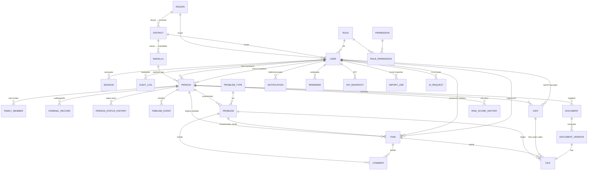

# 02 — Database Architecture

PostgreSQL 16 · Prisma ORM · Normalizatsiya (3NF) · Soft delete · Audit.

---

## 1. ER Diagramma (asosiy bog'lanishlar)



## 2. To'liq jadvallar ro'yxati (32)

| # | Jadval | Tavsif | # | Jadval | Tavsif |
|---|---|---|---|---|---|
| 1 | `regions` | Viloyatlar | 17 | `visits` | Tashriflar |
| 2 | `districts` | Tumanlar | 18 | `documents` | Elektron hujjatlar |
| 3 | `mahallas` | Mahallalar | 19 | `document_versions` | Hujjat versiyalari |
| 4 | `users` | Xodimlar | 20 | `files` | Yagona fayl metadata (MinIO) |
| 5 | `roles` | Rollar | 21 | `comments` | Universal izohlar |
| 6 | `permissions` | Ruxsatlar | 22 | `notifications` | Bildirishnomalar |
| 7 | `role_permissions` | Rol↔ruxsat | 23 | `notification_settings` | Kanal sozlamalari |
| 8 | `sessions` | Sessiya + refresh token + device | 24 | `reminders` | Smart Reminder |
| 9 | `ip_whitelist` | Ruxsat etilgan IP lar | 25 | `audit_logs` | Audit jurnali |
| 10 | `persons` | Otaliqqa olingan shaxslar | 26 | `kpi_snapshots` | KPI kunlik kesimlari |
| 11 | `family_members` | Oila a'zolari | 27 | `risk_score_history` | Risk ball tarixi |
| 12 | `criminal_records` | Sudlanganlik tarixi | 28 | `ai_requests` | AI so'rov/javob jurnali |
| 13 | `person_status_history` | Status o'zgarishlari | 29 | `import_jobs` | Excel import jarayonlari |
| 14 | `timeline_events` | Shaxs timeline | 30 | `export_jobs` | Export jarayonlari |
| 15 | `problem_types` | Muammo turlari (lug'at) | 31 | `settings` | Tizim sozlamalari (key-value) |
| 16 | `problems` | Muammolar | 32 | `telegram_links` | Xodim↔Telegram bog'lash |

## 3. Prisma Schema (to'liq)

```prisma
// =====================================================
//  GEO — hududlar
// =====================================================
model Region {
  id        Int        @id @default(autoincrement())
  name      String     @unique
  soato     String?    @unique              // SOATO/MHOBT kodi
  districts District[]
  users     User[]
  deletedAt DateTime?
  @@map("regions")
}

model District {
  id        Int       @id @default(autoincrement())
  regionId  Int
  region    Region    @relation(fields: [regionId], references: [id])
  name      String
  soato     String?   @unique
  mahallas  Mahalla[]
  users     User[]
  deletedAt DateTime?
  @@unique([regionId, name])
  @@index([regionId])
  @@map("districts")
}

model Mahalla {
  id         Int       @id @default(autoincrement())
  districtId Int
  district   District  @relation(fields: [districtId], references: [id])
  name       String
  persons    Person[]
  deletedAt  DateTime?
  @@unique([districtId, name])
  @@index([districtId])
  @@map("mahallas")
}

// =====================================================
//  IAM — foydalanuvchilar, rollar, ruxsatlar
// =====================================================
enum RoleCode {
  SUPER_ADMIN
  REPUBLIC        // Respublika rahbariyati
  REGION          // Viloyat
  DISTRICT        // Tuman
  PROSECUTOR      // Prokuror
  OPERATOR        // Operator
  VIEWER          // Kuzatuvchi
}

model Role {
  id          Int              @id @default(autoincrement())
  code        RoleCode         @unique
  name        String
  permissions RolePermission[]
  users       User[]
  @@map("roles")
}

model Permission {
  id    Int              @id @default(autoincrement())
  code  String           @unique   // masalan: "persons.create"
  name  String
  roles RolePermission[]
  @@map("permissions")
}

model RolePermission {
  roleId       Int
  permissionId Int
  role         Role       @relation(fields: [roleId], references: [id])
  permission   Permission @relation(fields: [permissionId], references: [id])
  @@id([roleId, permissionId])
  @@map("role_permissions")
}

model User {
  id             String    @id @default(uuid())
  username       String    @unique
  passwordHash   String
  fullName       String
  position       String?                    // lavozimi
  phone          String?
  email          String?   @unique
  avatarFileId   String?
  roleId         Int
  role           Role      @relation(fields: [roleId], references: [id])
  regionId       Int?                       // scope: viloyat
  region         Region?   @relation(fields: [regionId], references: [id])
  districtId     Int?                       // scope: tuman
  district       District? @relation(fields: [districtId], references: [id])
  isActive       Boolean   @default(true)
  twoFaSecret    String?                    // TOTP (shifrlangan)
  twoFaEnabled   Boolean   @default(false)
  lastLoginAt    DateTime?
  failedAttempts Int       @default(0)
  lockedUntil    DateTime?

  sessions            Session[]
  personsAsProsecutor Person[]  @relation("prosecutor")
  personsAsInspector  Person[]  @relation("inspector")
  createdTasks        Task[]    @relation("taskCreator")
  assignedTasks       Task[]    @relation("taskAssignee")
  visits              Visit[]
  notifications       Notification[]
  reminders           Reminder[]
  auditLogs           AuditLog[]
  kpiSnapshots        KpiSnapshot[]
  aiRequests          AiRequest[]
  importJobs          ImportJob[]
  exportJobs          ExportJob[]
  notificationSetting NotificationSetting?
  telegramLink        TelegramLink?

  createdAt DateTime  @default(now())
  updatedAt DateTime  @updatedAt
  deletedAt DateTime?
  @@index([roleId])
  @@index([regionId, districtId])
  @@map("users")
}

model Session {
  id               String   @id @default(uuid())
  userId           String
  user             User     @relation(fields: [userId], references: [id])
  refreshTokenHash String   @unique
  ip               String
  userAgent        String                    // device tracking
  deviceName       String?
  expiresAt        DateTime
  revokedAt        DateTime?
  createdAt        DateTime @default(now())
  @@index([userId])
  @@map("sessions")
}

model IpWhitelist {
  id        Int      @id @default(autoincrement())
  cidr      String   @unique                 // "10.0.0.0/16"
  label     String?
  isActive  Boolean  @default(true)
  createdAt DateTime @default(now())
  @@map("ip_whitelist")
}

// =====================================================
//  PERSONS — otaliqqa olingan shaxslar
// =====================================================
enum PersonStatus {
  NEW          // Yangi
  REVIEW       // Tekshiruv
  PROBLEM      // Muammo aniqlangan
  TASKED       // Topshiriq berilgan
  MONITORING   // Nazoratda
  RESOLVED     // Hal qilindi
  COMPLETED    // Yakunlandi (nazoratdan chiqarilgan)
}

enum RiskLevel { LOW MEDIUM HIGH CRITICAL }

enum MaritalStatus { SINGLE MARRIED DIVORCED WIDOWED }

model Person {
  id              String        @id @default(uuid())
  // Shaxsiy ma'lumotlar
  lastName        String
  firstName       String
  middleName      String?
  pinfl           String        @unique      // JShShIR (14 raqam)
  passportSeries  String?                    // AA
  passportNumber  String?                    // 1234567
  birthDate       DateTime
  photoFileId     String?
  phone           String?
  phoneExtra      String?
  // Manzil
  regionId        Int
  districtId      Int
  mahallaId       Int
  mahalla         Mahalla       @relation(fields: [mahallaId], references: [id])
  address         String
  latitude        Decimal?      @db.Decimal(9, 6)   // GPS
  longitude       Decimal?      @db.Decimal(9, 6)
  // Ijtimoiy holat
  maritalStatus   MaritalStatus?
  childrenCount   Int           @default(0)
  workplace       String?
  monthlyIncome   Decimal?      @db.Decimal(14, 2)
  education       String?
  profession      String?
  disability      String?                    // nogironlik guruhi/tavsifi
  // Nazorat ma'lumotlari
  crimeType       String?                    // jinoyat turi
  supervisedFrom  DateTime                   // nazoratga olingan sana
  supervisedTo    DateTime?                  // nazoratdan chiqarilgan sana
  prosecutorId    String
  prosecutor      User          @relation("prosecutor", fields: [prosecutorId], references: [id])
  inspectorId     String?
  inspector       User?         @relation("inspector", fields: [inspectorId], references: [id])
  status          PersonStatus  @default(NEW)
  riskLevel       RiskLevel     @default(MEDIUM)
  riskScore       Int           @default(0)  // 0–100 ball tizimi
  qrCode          String        @unique @default(uuid()) // QR verification token
  isArchived      Boolean       @default(false)

  familyMembers   FamilyMember[]
  criminalRecords CriminalRecord[]
  statusHistory   PersonStatusHistory[]
  timeline        TimelineEvent[]
  problems        Problem[]
  tasks           Task[]
  visits          Visit[]
  documents       Document[]
  riskHistory     RiskScoreHistory[]

  createdById String
  createdAt   DateTime  @default(now())
  updatedAt   DateTime  @updatedAt
  deletedAt   DateTime?

  @@index([regionId, districtId, mahallaId])
  @@index([status])
  @@index([riskLevel])
  @@index([prosecutorId])
  @@index([inspectorId])
  @@index([supervisedFrom])
  @@index([lastName, firstName])            // FIO qidiruv
  @@map("persons")
}

model FamilyMember {
  id        String    @id @default(uuid())
  personId  String
  person    Person    @relation(fields: [personId], references: [id])
  fullName  String
  relation  String                           // otasi, onasi, turmush o'rtog'i...
  birthYear Int?
  phone     String?
  note      String?
  deletedAt DateTime?
  @@index([personId])
  @@map("family_members")
}

model CriminalRecord {
  id           String    @id @default(uuid())
  personId     String
  person       Person    @relation(fields: [personId], references: [id])
  article      String                        // JK moddasi
  crimeType    String
  courtName    String?
  sentenceDate DateTime?
  releaseDate  DateTime?
  note         String?
  deletedAt    DateTime?
  @@index([personId])
  @@map("criminal_records")
}

model PersonStatusHistory {
  id          String       @id @default(uuid())
  personId    String
  person      Person       @relation(fields: [personId], references: [id])
  fromStatus  PersonStatus?
  toStatus    PersonStatus
  reason      String?
  changedById String
  createdAt   DateTime     @default(now())
  @@index([personId])
  @@map("person_status_history")
}

model RiskScoreHistory {
  id        String   @id @default(uuid())
  personId  String
  person    Person   @relation(fields: [personId], references: [id])
  score     Int
  level     RiskLevel
  source    String                           // "AI" | "MANUAL" | "RULE"
  factors   Json?                            // hisoblash omillari
  createdAt DateTime @default(now())
  @@index([personId, createdAt])
  @@map("risk_score_history")
}

// =====================================================
//  TIMELINE — shaxs bo'yicha barcha voqealar
// =====================================================
enum TimelineEventType {
  CREATED | UPDATED | STATUS_CHANGED | VISIT | PROBLEM | PROBLEM_RESOLVED
  TASK | TASK_COMPLETED | DOCUMENT | COMMENT | RISK_CHANGED | ARCHIVED
}

model TimelineEvent {
  id         String            @id @default(uuid())
  personId   String
  person     Person            @relation(fields: [personId], references: [id])
  type       TimelineEventType
  title      String
  payload    Json?                            // bog'liq entity id/qisqacha ma'lumot
  actorId    String                           // kim bajargan
  createdAt  DateTime          @default(now()) // qachon bajargan
  @@index([personId, createdAt(sort: Desc)])
  @@map("timeline_events")
}

// =====================================================
//  PROBLEMS — muammolar
// =====================================================
enum ProblemStatus { OPEN IN_PROGRESS ON_CONTROL RESOLVED REJECTED }
enum Severity { LOW MEDIUM HIGH CRITICAL }

model ProblemType {
  id       Int       @id @default(autoincrement())
  code     String    @unique   // EMPLOYMENT, HOUSING, CREDIT, MEDICAL, EDUCATION,
                               // DOCUMENT, PSYCHOLOGICAL, FINANCIAL_AID, FAMILY, OTHER
  name     String
  isActive Boolean   @default(true)
  problems Problem[]
  @@map("problem_types")
}

model Problem {
  id             String        @id @default(uuid())
  personId       String
  person         Person        @relation(fields: [personId], references: [id])
  typeId         Int
  type           ProblemType   @relation(fields: [typeId], references: [id])
  title          String
  description    String?
  status         ProblemStatus @default(OPEN)
  severity       Severity      @default(MEDIUM)
  responsibleOrg String?                      // mas'ul tashkilot
  assigneeId     String?                      // bajaruvchi xodim
  deadline       DateTime?                    // muddat
  resolvedAt     DateTime?
  resolutionNote String?
  comments       Comment[]
  files          File[]
  tasks          Task[]
  createdById    String
  createdAt      DateTime      @default(now())
  updatedAt      DateTime      @updatedAt
  deletedAt      DateTime?
  @@index([personId])
  @@index([status, deadline])
  @@index([typeId])
  @@map("problems")
}

// =====================================================
//  TASKS — elektron topshiriqlar
// =====================================================
enum TaskStatus { NEW IN_PROGRESS SUBMITTED APPROVED REJECTED COMPLETED CANCELLED }
enum TaskPriority { LOW MEDIUM HIGH URGENT }

model Task {
  id          String       @id @default(uuid())
  title       String
  description String?
  personId    String?                        // shaxsga bog'liq bo'lishi mumkin
  person      Person?      @relation(fields: [personId], references: [id])
  problemId   String?                        // muammodan kelib chiqishi mumkin
  problem     Problem?     @relation(fields: [problemId], references: [id])
  creatorId   String                         // rahbar
  creator     User         @relation("taskCreator", fields: [creatorId], references: [id])
  assigneeId  String                         // mas'ul bajaruvchi
  assignee    User         @relation("taskAssignee", fields: [assigneeId], references: [id])
  priority    TaskPriority @default(MEDIUM)
  status      TaskStatus   @default(NEW)
  progress    Int          @default(0)       // 0–100
  deadline    DateTime
  submittedAt DateTime?                      // bajaruvchi topshirgan vaqt
  approvedAt  DateTime?                      // rahbar tasdiqlagan vaqt
  completedAt DateTime?
  comments    Comment[]
  files       File[]
  createdAt   DateTime     @default(now())
  updatedAt   DateTime     @updatedAt
  deletedAt   DateTime?
  @@index([assigneeId, status])
  @@index([creatorId])
  @@index([status, deadline])
  @@index([personId])
  @@map("tasks")
}

// =====================================================
//  VISITS — tashriflar
// =====================================================
model Visit {
  id           String    @id @default(uuid())
  personId     String
  person       Person    @relation(fields: [personId], references: [id])
  visitorId    String                         // kim tashrif buyurgan
  visitor      User      @relation(fields: [visitorId], references: [id])
  visitedAt    DateTime                       // sana + vaqt
  latitude     Decimal?  @db.Decimal(9, 6)    // GPS (joyida qayd)
  longitude    Decimal?  @db.Decimal(9, 6)
  summary      String                         // xulosa
  audioNote    String?                        // audio izoh (file id)
  nextVisitAt  DateTime?                      // keyingi tashrif sanasi
  files        File[]                         // foto / video
  createdAt    DateTime  @default(now())
  updatedAt    DateTime  @updatedAt
  deletedAt    DateTime?
  @@index([personId, visitedAt(sort: Desc)])
  @@index([visitorId])
  @@index([nextVisitAt])
  @@map("visits")
}

// =====================================================
//  DOCUMENTS — elektron hujjatlar (versioning + QR)
// =====================================================
model Document {
  id           String            @id @default(uuid())
  personId     String?
  person       Person?           @relation(fields: [personId], references: [id])
  title        String
  category     String?                        // qaror, ma'lumotnoma, dalolatnoma...
  qrCode       String            @unique @default(uuid()) // QR verification
  versions     DocumentVersion[]
  createdById  String
  createdAt    DateTime          @default(now())
  updatedAt    DateTime          @updatedAt
  deletedAt    DateTime?
  @@index([personId])
  @@map("documents")
}

model DocumentVersion {
  id          String   @id @default(uuid())
  documentId  String
  document    Document @relation(fields: [documentId], references: [id])
  version     Int                              // 1, 2, 3...
  fileId      String   @unique
  file        File     @relation(fields: [fileId], references: [id])
  note        String?                          // versiya izohi
  createdById String
  createdAt   DateTime @default(now())
  @@unique([documentId, version])
  @@map("document_versions")
}

// =====================================================
//  FILES — yagona fayl metadata (MinIO)
// =====================================================
enum FileKind { IMAGE PDF WORD EXCEL VIDEO AUDIO OTHER }

model File {
  id          String    @id @default(uuid())
  bucket      String                           // "documents" | "photos" | "media"
  objectKey   String                           // MinIO kaliti
  originalName String
  mimeType    String
  kind        FileKind
  sizeBytes   BigInt
  checksum    String?                          // SHA-256 (yaxlitlik)
  uploadedById String
  // polymorphic bog'lanishlar
  problemId   String?
  problem     Problem?  @relation(fields: [problemId], references: [id])
  taskId      String?
  task        Task?     @relation(fields: [taskId], references: [id])
  visitId     String?
  visit       Visit?    @relation(fields: [visitId], references: [id])
  documentVersion DocumentVersion?
  createdAt   DateTime  @default(now())
  deletedAt   DateTime?
  @@index([problemId]) @@index([taskId]) @@index([visitId])
  @@map("files")
}

// =====================================================
//  COMMENTS — universal izohlar
// =====================================================
model Comment {
  id        String   @id @default(uuid())
  body      String
  authorId  String
  problemId String?
  problem   Problem? @relation(fields: [problemId], references: [id])
  taskId    String?
  task      Task?    @relation(fields: [taskId], references: [id])
  createdAt DateTime @default(now())
  deletedAt DateTime?
  @@index([problemId]) @@index([taskId])
  @@map("comments")
}

// =====================================================
//  NOTIFICATIONS & REMINDERS
// =====================================================
enum NotifChannel { IN_APP BROWSER TELEGRAM SMS EMAIL }
enum NotifType {
  TASK_ASSIGNED | TASK_DEADLINE | TASK_OVERDUE | VISIT_DUE | VISIT_OVERDUE
  PROBLEM_DEADLINE | NEW_DOCUMENT | NEW_COMMENT | BIRTHDAY | SYSTEM
}

model Notification {
  id        String       @id @default(uuid())
  userId    String
  user      User         @relation(fields: [userId], references: [id])
  type      NotifType
  title     String
  body      String
  link      String?                           // frontend route
  channels  NotifChannel[]
  isRead    Boolean      @default(false)
  sentAt    DateTime?
  createdAt DateTime     @default(now())
  @@index([userId, isRead, createdAt(sort: Desc)])
  @@map("notifications")
}

model NotificationSetting {
  userId    String  @id
  user      User    @relation(fields: [userId], references: [id])
  inApp     Boolean @default(true)
  telegram  Boolean @default(false)
  sms       Boolean @default(false)
  email     Boolean @default(false)
  @@map("notification_settings")
}

model TelegramLink {
  userId     String   @id
  user       User     @relation(fields: [userId], references: [id])
  chatId     String   @unique
  linkedAt   DateTime @default(now())
  @@map("telegram_links")
}

model Reminder {
  id         String    @id @default(uuid())
  userId     String
  user       User      @relation(fields: [userId], references: [id])
  type       NotifType
  entityType String                            // "task" | "visit" | "problem" | "person"
  entityId   String
  remindAt   DateTime
  firedAt    DateTime?
  createdAt  DateTime  @default(now())
  @@index([remindAt, firedAt])
  @@map("reminders")
}

// =====================================================
//  AUDIT
// =====================================================
enum AuditAction {
  LOGIN | LOGOUT | LOGIN_FAILED | CREATE | UPDATE | DELETE | RESTORE
  EXPORT | IMPORT | DOWNLOAD | VIEW_SENSITIVE | PERMISSION_CHANGE
}

model AuditLog {
  id         BigInt      @id @default(autoincrement())
  userId     String?
  user       User?       @relation(fields: [userId], references: [id])
  action     AuditAction
  entityType String?                            // "Person", "Task"...
  entityId   String?
  oldValue   Json?                              // eski qiymat
  newValue   Json?                              // yangi qiymat
  ip         String?
  userAgent  String?                            // browser + device
  createdAt  DateTime    @default(now())
  @@index([userId, createdAt(sort: Desc)])
  @@index([entityType, entityId])
  @@index([action, createdAt])
  @@map("audit_logs")
}

// =====================================================
//  KPI · AI · IMPORT/EXPORT · SETTINGS
// =====================================================
model KpiSnapshot {
  id                 String   @id @default(uuid())
  userId             String
  user               User     @relation(fields: [userId], references: [id])
  periodDate         DateTime @db.Date          // kunlik kesim
  tasksCompleted     Int      @default(0)
  tasksOverdue       Int      @default(0)
  visitsDone         Int      @default(0)
  problemsResolved   Int      @default(0)
  avgResolutionHours Decimal? @db.Decimal(10, 2)
  rating             Decimal? @db.Decimal(5, 2) // hisoblangan reyting
  @@unique([userId, periodDate])
  @@map("kpi_snapshots")
}

model AiRequest {
  id           String   @id @default(uuid())
  userId       String
  user         User     @relation(fields: [userId], references: [id])
  kind         String                            // "RISK" | "QUERY" | "SUMMARY" | "REPORT" | "ANALYSIS" | "FORECAST"
  prompt       String
  response     String?
  model        String?
  status       String   @default("PENDING")     // PENDING | DONE | FAILED
  latencyMs    Int?
  createdAt    DateTime @default(now())
  @@index([userId, createdAt])
  @@map("ai_requests")
}

model ImportJob {
  id           String   @id @default(uuid())
  userId       String
  user         User     @relation(fields: [userId], references: [id])
  fileId       String
  status       String   @default("PENDING")     // PENDING | VALIDATING | DONE | FAILED
  totalRows    Int?
  successRows  Int?
  errorRows    Int?
  duplicates   Int?                              // duplicate detection natijasi
  errorReport  Json?                             // qator-ma-qator xatolar
  createdAt    DateTime @default(now())
  finishedAt   DateTime?
  @@map("import_jobs")
}

model ExportJob {
  id         String   @id @default(uuid())
  userId     String
  user       User     @relation(fields: [userId], references: [id])
  entityType String                               // "persons" | "tasks" | ...
  filters    Json?
  fileId     String?
  status     String   @default("PENDING")
  createdAt  DateTime @default(now())
  finishedAt DateTime?
  @@map("export_jobs")
}

model Setting {
  key       String   @id                          // "org.name", "org.logo", "security.session_ttl"...
  value     Json
  updatedBy String?
  updatedAt DateTime @updatedAt
  @@map("settings")
}
```

> Eslatma: `enum` larda `|` belgisi o'qish qulayligi uchun; haqiqiy Prisma faylida har bir qiymat alohida qatorda yoziladi.

## 4. Ma'lumotlar bazasi strategiyalari

### 4.1 Normalizatsiya
- 3NF: hududlar (`regions`→`districts`→`mahallas`), lug'atlar (`problem_types`) alohida jadvallarda.
- `persons` jadvalida `regionId`/`districtId` denormalizatsiya qilingan (mahalla orqali aniqlanadi) — **ataylab**: scope-filter va hisobotlarda JOIN'siz tez ishlash uchun; yozishda service qatlamida sinxronlanadi.

### 4.2 Indekslash
| Ehtiyoj | Index |
|---|---|
| Scope filtrlash | `persons(regionId, districtId, mahallaId)` |
| Deadline nazorati | `tasks(status, deadline)`, `problems(status, deadline)`, `visits(nextVisitAt)` |
| Timeline | `timeline_events(personId, createdAt DESC)` |
| Audit qidiruv | `audit_logs(entityType, entityId)`, `(userId, createdAt DESC)` |
| To'liq matnli qidiruv | PostgreSQL `pg_trgm` GIN index: `persons(lastName || firstName || pinfl || phone)` |

### 4.3 Soft delete
- Barcha biznes jadvallarda `deletedAt` ustuni; Prisma middleware/extension `deletedAt IS NULL` filtrini avtomatik qo'shadi.
- `DELETE` → `UPDATE deletedAt = now()` + AuditLog(`DELETE`). `RESTORE` faqat Admin/rahbar uchun.
- Arxiv: `persons.isArchived = true` (nazoratdan chiqarilganlar) — soft delete emas, alohida biznes holat.

### 4.4 Audit jadvallari
- `audit_logs` — append-only: ilova darajasida UPDATE/DELETE taqiqlanadi, DB darajasida trigger bilan himoyalanadi.
- Oylik partitsiyalash (PostgreSQL declarative partitioning, `createdAt` bo'yicha) — hajm o'sganda samaradorlik.
- `timeline_events` va `person_status_history` — domenga xos, foydalanuvchiga ko'rinadigan tarix; `audit_logs` — texnik-huquqiy jurnal.

### 4.5 Migratsiyalar
- Faqat `prisma migrate` (SQL migratsiya fayllari git'da).
- Seed: rollar, permissionlar, muammo turlari, viloyat/tuman ro'yxati (SOATO), demo admin.
