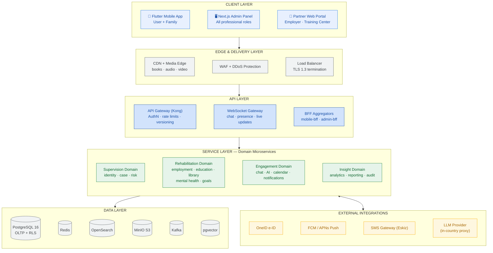
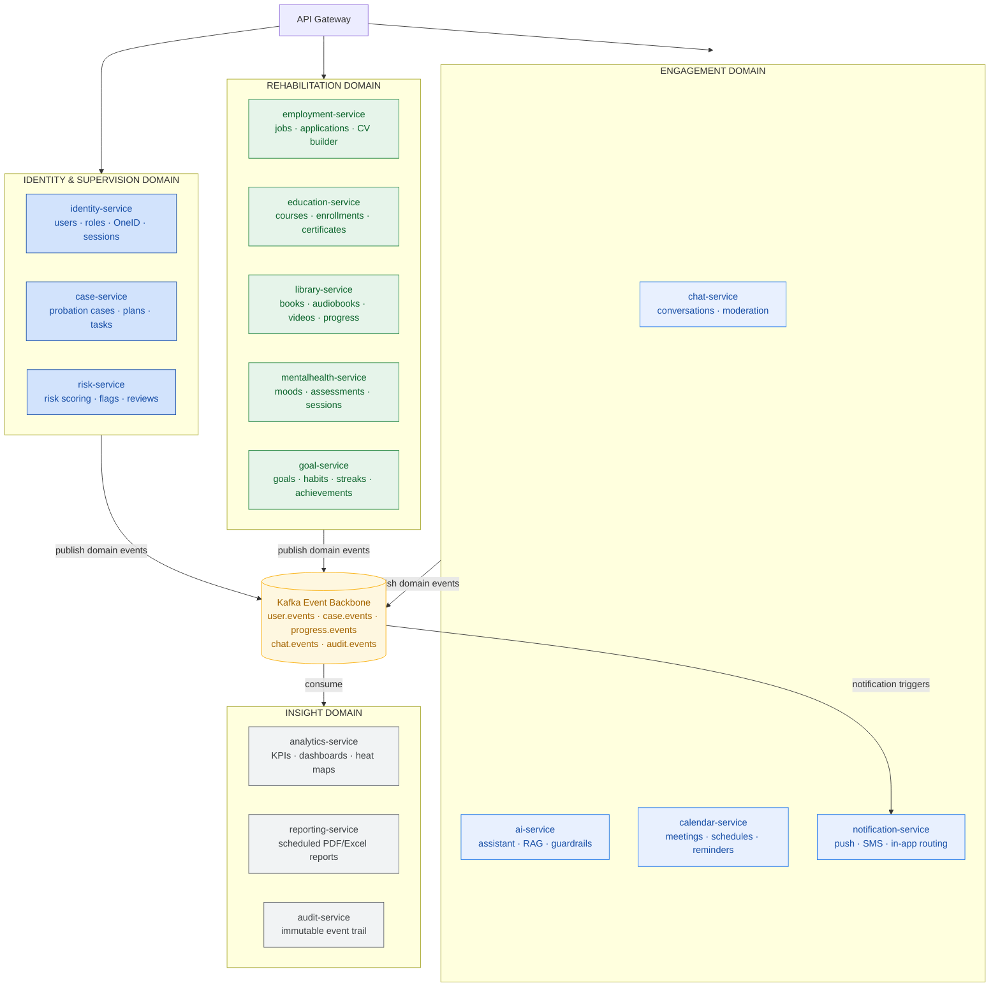
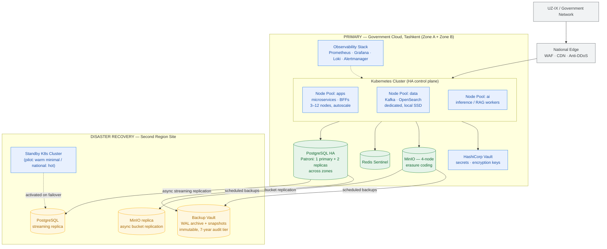
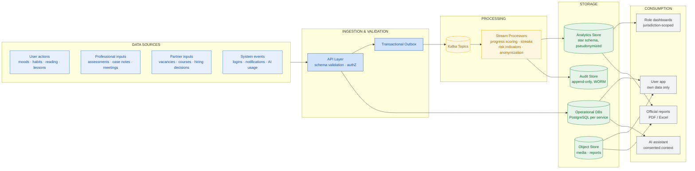
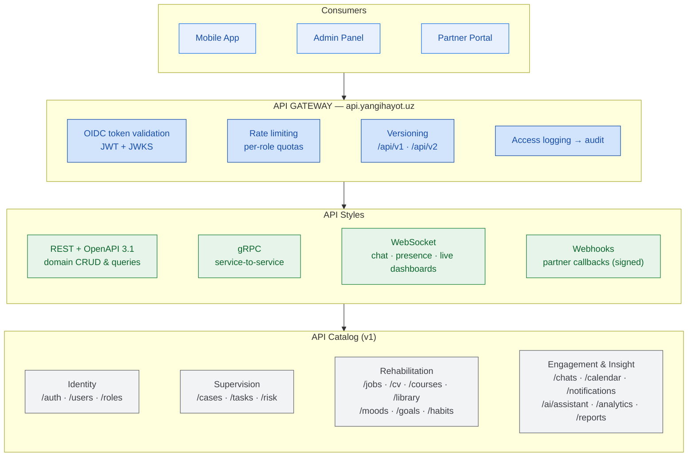

# 02 — System & Infrastructure Architecture

Covers: System Architecture · Backend Microservices · Cloud Infrastructure · Data Flow · API Architecture · Folder Structure

---

## 4. System Architecture (Layered View)



**Pilot-to-national scaling note.** At 50 users, services run as modest replicas on a small
Kubernetes cluster; the identical topology scales horizontally per layer — no re-architecture
between pilot and national rollout. District ID is a first-class tenancy key in every service.

---

## 5. Backend Microservice Architecture



**Service design rules**

| Rule | Detail |
|---|---|
| Database-per-service | Each service owns its PostgreSQL schema; cross-service reads via API or events only |
| Sync + async | REST/gRPC for commands & queries; Kafka events for facts (\"user completed course\") |
| Tenancy | Every table carries `district_id`; RLS enforces jurisdiction at the database layer |
| Idempotency | All event consumers idempotent; outbox pattern for reliable publishing |
| Sensitive isolation | `mentalhealth-service` data is encrypted with a separate key and never flows to analytics in raw form |

---

## 15. Cloud Infrastructure



**Sizing**

| Phase | Users | App nodes | DB | Notes |
|---|---|---|---|---|
| Pilot (Sherobod) | 50 | 3 × 8 vCPU | 1×primary + 1×replica | Single cluster, warm DR |
| Region | ~1,500 | 6–8 nodes | +1 replica, PgBouncer | Read replicas for analytics |
| National | ~50,000+ | 12+ nodes, multi-cluster | Citus/partitioning by region | Hot DR, regional edge caches |

---

## 16. Data Flow Diagram



**Data classification**

| Class | Examples | Handling |
|---|---|---|
| C1 Public | Course catalog, library titles | Standard controls |
| C2 Internal | Tasks, goals, achievements | Encrypted at rest, role-scoped |
| C3 Personal | Identity, employment, case data | RLS + field encryption, audit on read |
| C4 Sensitive | Mental-health records, chat content | Separate keys, need-to-know, never in analytics raw |

---

## 29. API Architecture



**API standards**

- OpenAPI 3.1 contract-first; generated typed clients for Flutter and TypeScript
- Cursor pagination, RFC 9457 problem-details errors, `Accept-Language: uz | uz-Cyrl | ru`
- Response envelope carries `district_id` scoping context; server-side enforcement always wins
- Deprecation policy: N-1 version supported 12 months after N release

---

## 30. Folder Structure (Monorepo)

```text
yangi-hayot/
├── apps/
│   ├── mobile/                     # Flutter — user & family app
│   │   ├── lib/
│   │   │   ├── core/               # theme, i18n (uz, uz-Cyrl, ru), router, DI
│   │   │   ├── features/
│   │   │   │   ├── auth/           ├── dashboard/       ├── motivation/
│   │   │   │   ├── tasks/          ├── goals/           ├── habits/
│   │   │   │   ├── mood/           ├── courses/         ├── library/
│   │   │   │   ├── audiobooks/     ├── videos/          ├── jobs/
│   │   │   │   ├── cv_builder/     ├── chat/            ├── ai_assistant/
│   │   │   │   ├── calendar/       ├── achievements/    ├── notifications/
│   │   │   │   └── profile/
│   │   │   └── shared/             # widgets, offline sync, analytics client
│   │   └── test/
│   ├── admin-web/                  # Next.js — professional roles
│   │   └── src/
│   │       ├── app/(dashboard)/    # analytics, users, cases, risk, reports
│   │       ├── app/(management)/   # meetings, tasks, notifications, logs
│   │       └── modules/            # charts, heatmaps, permission-aware UI kit
│   └── partner-web/                # Next.js — employers & training centers
├── services/
│   ├── identity-service/           # each service: src/{api,domain,infra,events}
│   ├── case-service/
│   ├── risk-service/
│   ├── employment-service/
│   ├── education-service/
│   ├── library-service/
│   ├── mentalhealth-service/
│   ├── goal-service/
│   ├── chat-service/
│   ├── ai-service/
│   ├── calendar-service/
│   ├── notification-service/
│   ├── analytics-service/
│   ├── reporting-service/
│   └── audit-service/
├── packages/                       # shared libraries
│   ├── contracts/                  # OpenAPI + protobuf + event schemas
│   ├── auth-lib/                   # JWT validation, RBAC guards, RLS helpers
│   ├── kafka-lib/                  # outbox, idempotent consumers
│   └── ui-kit/                     # design system (web)
├── infra/
│   ├── terraform/                  # cloud resources per environment
│   ├── k8s/                        # Helm charts, Kustomize overlays (dev/stage/prod)
│   ├── observability/              # dashboards, alerts, SLOs
│   └── security/                   # policies, vault config, network rules
├── docs/                           # this architecture set + ADRs
│   └── adr/
└── tools/                          # codegen, seeding, load tests
```
