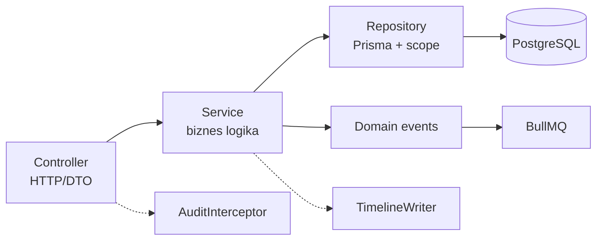

# 03 — Backend Architecture

NestJS 11 · Prisma · Redis · BullMQ · REST API + Swagger.

---

## 1. Folder Structure (monorepo)

```
yangi-hayot/
├── apps/
│   ├── api/                          # NestJS REST API
│   │   ├── src/
│   │   │   ├── main.ts               # bootstrap, Swagger, global pipes
│   │   │   ├── app.module.ts
│   │   │   │
│   │   │   ├── common/               # cross-cutting
│   │   │   │   ├── decorators/       # @CurrentUser, @RequirePermission, @Scoped
│   │   │   │   ├── guards/           # JwtAuthGuard, PermissionGuard, ScopeGuard
│   │   │   │   ├── interceptors/     # AuditInterceptor, TransformInterceptor
│   │   │   │   ├── filters/          # AllExceptionsFilter (standart error format)
│   │   │   │   ├── pipes/            # ZodValidationPipe
│   │   │   │   ├── dto/              # PaginationDto, SortDto, umumiy DTO lar
│   │   │   │   └── utils/
│   │   │   │
│   │   │   ├── infra/                # infratuzilma adapterlari
│   │   │   │   ├── prisma/           # PrismaService (+soft-delete extension)
│   │   │   │   ├── redis/            # RedisService, CacheService
│   │   │   │   ├── storage/          # MinioService (presigned URL)
│   │   │   │   ├── queue/            # BullMQ ulanish, queue registry
│   │   │   │   └── config/           # typed config (env validation)
│   │   │   │
│   │   │   └── modules/              # DOMEN MODULLARI
│   │   │       ├── auth/             # login, refresh, logout, 2FA
│   │   │       ├── users/            # xodimlar CRUD, rollar, permissionlar
│   │   │       ├── geo/              # viloyat, tuman, mahalla
│   │   │       ├── persons/          # shaxslar + family + criminal-records
│   │   │       ├── timeline/         # timeline events (read + writer service)
│   │   │       ├── problems/         # muammolar + turlar
│   │   │       ├── tasks/            # topshiriqlar + workflow
│   │   │       ├── visits/           # tashriflar
│   │   │       ├── documents/        # hujjatlar + versioning + QR verify
│   │   │       ├── files/            # upload/download, preview
│   │   │       ├── comments/         # universal izohlar
│   │   │       ├── excel/            # import/export/template
│   │   │       ├── search/           # aqlli qidiruv + advanced filters
│   │   │       ├── dashboard/       # real-time statistika, widgetlar
│   │   │       ├── analytics/        # chartlar, heatmap, comparison
│   │   │       ├── gis/              # xarita uchun geo-data endpointlar
│   │   │       ├── kpi/              # KPI hisoblash + snapshotlar
│   │   │       ├── notifications/    # in-app + kanal dispatcherlar
│   │   │       ├── reminders/        # smart reminder qoidalari
│   │   │       ├── ai/               # Smart AI (risk, query, report)
│   │   │       ├── audit/            # audit log yozish/o'qish
│   │   │       ├── archive/          # arxiv ko'rinishlari
│   │   │       ├── monitoring-center/# katta ekran API + WS
│   │   │       ├── settings/         # tizim sozlamalari
│   │   │       └── health/           # liveness/readiness
│   │   └── test/                     # e2e testlar
│   │
│   ├── worker/                       # BullMQ processors (alohida process)
│   │   └── src/
│   │       ├── processors/
│   │       │   ├── notification.processor.ts   # Telegram/SMS/Email jo'natish
│   │       │   ├── reminder.processor.ts       # cron: muddat skanerlash
│   │       │   ├── excel.processor.ts          # og'ir import/export
│   │       │   ├── ai.processor.ts             # LLM so'rovlar
│   │       │   ├── kpi.processor.ts            # kunlik KPI snapshot
│   │       │   └── backup.processor.ts         # pg_dump + verify
│   │       └── main.ts
│   │
│   └── web/                          # Next.js (04-hujjatda)
│
├── packages/
│   ├── shared/                       # umumiy types, enums, constants, zod schemas
│   │   └── src/{enums,schemas,permissions,i18n}/
│   └── eslint-config/                # yagona lint qoidalari
│
├── prisma/
│   ├── schema.prisma
│   ├── migrations/
│   └── seed.ts
│
├── docker/
│   ├── docker-compose.yml            # local dev
│   ├── docker-compose.prod.yml
│   └── nginx/nginx.conf
│
├── .github/workflows/{ci.yml,deploy.yml}
└── docs/
```

**Har bir domen modul ichki tuzilishi** (misol: `persons/`):

```
persons/
├── persons.module.ts
├── persons.controller.ts        # HTTP qatlam — faqat DTO ↔ service
├── persons.service.ts           # biznes logika
├── persons.repository.ts        # Prisma so'rovlar (scope filter shu yerda)
├── dto/
│   ├── create-person.dto.ts
│   ├── update-person.dto.ts
│   └── person-query.dto.ts      # filter/sort/pagination
└── persons.controller.spec.ts / persons.service.spec.ts
```

## 2. REST API strukturasi

**Baza:** `https://<host>/api/v1` · **Hujjat:** `GET /api/docs` (Swagger UI, faqat ichki tarmoq).

### 2.1 Standart javob konverti

```jsonc
// muvaffaqiyat
{ "success": true, "data": { ... }, "meta": { "page": 1, "limit": 20, "total": 154, "totalPages": 8 } }
// xatolik
{ "success": false, "error": { "code": "PERSON_NOT_FOUND", "message": "Shaxs topilmadi", "details": null }, "requestId": "..." }
```

### 2.2 Umumiy so'rov parametrlari

`?page=1&limit=20&sort=createdAt:desc&search=...&filter[status]=MONITORING&filter[regionId]=3`

### 2.3 Endpointlar (asosiylari)

| Modul | Endpointlar |
|---|---|
| **Auth** | `POST /auth/login` · `POST /auth/2fa/verify` · `POST /auth/refresh` · `POST /auth/logout` · `GET /auth/me` · `GET /auth/sessions` · `DELETE /auth/sessions/:id` |
| **Users** | `GET/POST /users` · `GET/PATCH/DELETE /users/:id` · `GET /roles` · `PATCH /roles/:id/permissions` |
| **Geo** | `GET /geo/regions` · `GET /geo/regions/:id/districts` · `GET /geo/districts/:id/mahallas` · CRUD (admin) |
| **Persons** | `GET/POST /persons` · `GET/PATCH/DELETE /persons/:id` · `GET /persons/:id/timeline` · `POST /persons/:id/status` · `GET /persons/:id/qr` · `CRUD /persons/:id/family-members` · `CRUD /persons/:id/criminal-records` · `POST /persons/:id/archive` |
| **Problems** | `GET/POST /problems` · `GET/PATCH /problems/:id` · `POST /problems/:id/resolve` · `GET /problem-types` |
| **Tasks** | `GET/POST /tasks` · `GET/PATCH /tasks/:id` · `POST /tasks/:id/submit` · `POST /tasks/:id/approve` · `POST /tasks/:id/reject` · `GET /tasks/my` |
| **Visits** | `GET/POST /visits` · `GET/PATCH /visits/:id` · `GET /visits/overdue` |
| **Documents** | `GET/POST /documents` · `GET /documents/:id` · `POST /documents/:id/versions` · `GET /documents/:id/versions/:v/download` · `GET /verify/:qrCode` (QR tekshiruv) |
| **Files** | `POST /files/upload` (multipart) · `GET /files/:id/download` · `GET /files/:id/preview` |
| **Comments** | `GET/POST /comments?entity=task&id=...` |
| **Excel** | `GET /excel/template/:entity` · `POST /excel/import/:entity` · `GET /excel/import/:jobId/status` · `POST /excel/export/:entity` |
| **Search** | `GET /search?q=...` (global) · `POST /search/advanced` (murakkab filter to'plami) |
| **Dashboard** | `GET /dashboard/summary` · `GET /dashboard/today` · `GET /dashboard/overdue` · `GET /dashboard/top-regions` · `GET /dashboard/top-employees` · `GET /dashboard/recent-activity` · `GET /dashboard/risk-indicators` |
| **Analytics** | `GET /analytics/charts/:kind` · `GET /analytics/heatmap` · `GET /analytics/comparison` · `GET /analytics/trends` |
| **GIS** | `GET /gis/persons` (geo-markerlar, bbox/filter) · `GET /gis/heatmap` · `GET /gis/radius?lat=&lng=&km=` |
| **KPI** | `GET /kpi/employees` · `GET /kpi/employees/:id` · `GET /kpi/rating` |
| **Notifications** | `GET /notifications` · `PATCH /notifications/:id/read` · `PATCH /notifications/read-all` · `GET/PATCH /notifications/settings` · `POST /notifications/telegram/link` |
| **AI** | `POST /ai/query` (tabiiy tildagi so'rov) · `POST /ai/persons/:id/summary` · `POST /ai/persons/:id/risk` · `POST /ai/report` · `GET /ai/requests/:id` |
| **Audit** | `GET /audit` (filter: user, action, entity, sana) · `GET /audit/entity/:type/:id` |
| **Archive** | `GET /archive/persons` · `GET /archive/documents` · `POST /archive/persons/:id/restore` |
| **Monitoring Center** | `GET /monitoring/live` · WS `monitoring-center` kanali |
| **Settings** | `GET/PATCH /settings` · lug'atlar CRUD |
| **Health** | `GET /health` · `GET /health/ready` |

### 2.4 API dizayn qoidalari

1. **Versioning:** URI orqali (`/api/v1`); breaking change faqat yangi versiyada.
2. **Pagination:** hamma ro'yxatlar majburiy `page/limit` (default 20, max 100).
3. **Filtering/Sorting/Search:** `filter[...]`, `sort=field:dir`, `search=` — DTO da whitelist qilingan maydonlargina.
4. **Idempotency:** yaratish endpointlarida `Idempotency-Key` sarlavhasi (Excel import, task create).
5. **Swagger:** har DTO `@ApiProperty` bilan; auth `bearerAuth`; production'da faqat ichki IP dan ochiladi.

## 3. Backend qatlamlari va qoidalari



| Qatlam | Qoida |
|---|---|
| Controller | Faqat: DTO validatsiya, service chaqiruv, javob. Biznes logika yo'q. |
| Service | Tranzaksiya chegarasi (`prisma.$transaction`), domen qoidalar, TimelineWriter chaqiruv |
| Repository | Barcha Prisma so'rovlar; **scope filtri shu yerda majburiy** (`applyScope(where, user)`) |
| Events | `person.created`, `task.overdue` kabi ichki eventlar → notification/reminder modullariga |

## 4. Background jobs (BullMQ)

| Queue | Job | Trigger |
|---|---|---|
| `notifications` | Kanalga jo'natish (Telegram/SMS/Email) | Domain event |
| `reminders` | Muddat skaneri: task/visit/problem deadline, tug'ilgan kunlar | Cron: har 15 daqiqa / kunlik 06:00 |
| `excel` | Import (validate→duplicate check→insert), export (stream→MinIO) | Foydalanuvchi so'rovi |
| `ai` | LLM so'rovlar (summary, report, risk batch) | Foydalanuvchi so'rovi / kunlik cron |
| `kpi` | Kunlik KPI snapshot hisoblash | Cron: 23:55 |
| `backup` | pg_dump + gzip + off-site nusxa + tekshiruv | Cron: kunlik 02:00 |

Barcha joblar: retry (exponential backoff, 3 urinish), dead-letter queue, Grafana'da queue depth metrikasi.

## 5. Xatoliklarni boshqarish

- Domen xatolari — typed exception (`PersonNotFoundError` → 404, `ScopeViolationError` → 403).
- `AllExceptionsFilter` barcha xatolarni standart envelope'ga o'giradi; 5xx larda stack faqat logda.
- Har javobda `requestId` (log correlation).
