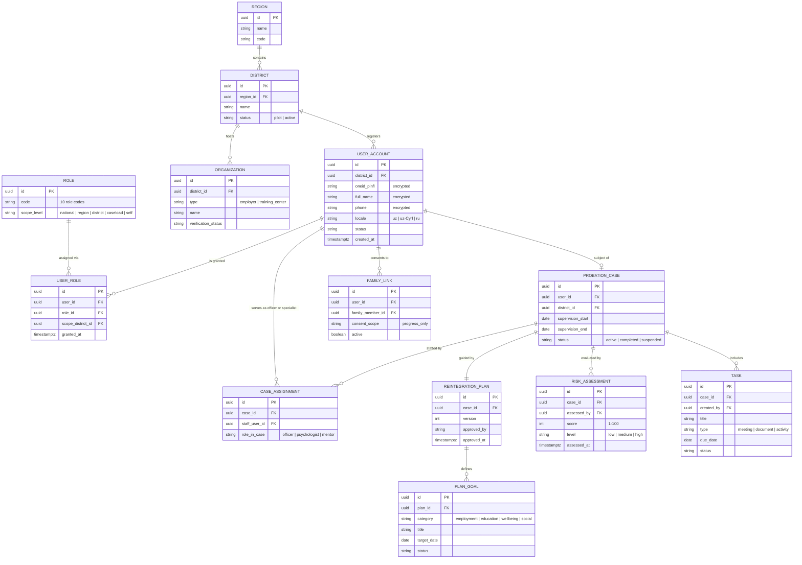
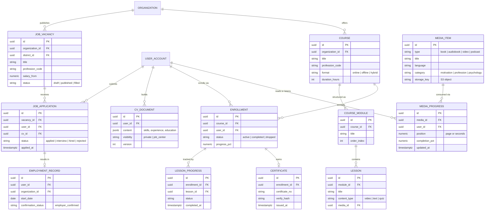

# 03 — Data Architecture

Covers: Database ER Diagram (logical model, core entities).

---

## 6. Database ER Diagram

The model is organized around four clusters: **Identity & Jurisdiction**, **Supervision**,
**Rehabilitation**, and **Engagement & Audit**. Every operational table carries `district_id`
for tenancy and row-level security.

### 6.1 Identity, Jurisdiction & Supervision

### 6.2 Rehabilitation: Employment, Education, Library

### 6.3 Well-being, Engagement & Audit

```mermaid
erDiagram
    USER_ACCOUNT ||--o{ MOOD_ENTRY : "checks in"
    USER_ACCOUNT ||--o{ PSY_SESSION : "attends"
    USER_ACCOUNT ||--o{ HABIT : "commits to"
    HABIT ||--o{ HABIT_LOG : "logged daily"
    USER_ACCOUNT ||--o{ USER_GOAL : "sets"
    USER_ACCOUNT ||--o{ USER_ACHIEVEMENT : "unlocks"
    ACHIEVEMENT ||--o{ USER_ACHIEVEMENT : "instantiated as"
    CONVERSATION ||--o{ MESSAGE : "contains"
    USER_ACCOUNT ||--o{ CONVERSATION_MEMBER : "participates via"
    CONVERSATION ||--o{ CONVERSATION_MEMBER : "has"
    USER_ACCOUNT ||--o{ MEETING : "attends"
    USER_ACCOUNT ||--o{ NOTIFICATION : "receives"
    USER_ACCOUNT ||--o{ AI_CONVERSATION : "talks to assistant"
    USER_ACCOUNT ||--o{ AUDIT_EVENT : "actions recorded as"

    MOOD_ENTRY {
        uuid id PK
        uuid user_id FK
        int mood_score "1-5"
        string tags "sleep, family, work"
        text note "encrypted, user-private"
        timestamptz created_at
    }
    PSY_SESSION {
        uuid id PK
        uuid user_id FK
        uuid psychologist_id FK
        string type "scheduled | crisis"
        text clinical_note "encrypted, psychologist-only"
        timestamptz held_at
    }
    HABIT {
        uuid id PK
        uuid user_id FK
        string title
        string schedule "daily | weekly"
        int current_streak
        int best_streak
    }
    HABIT_LOG {
        uuid id PK
        uuid habit_id FK
        date log_date
        boolean done
    }
    USER_GOAL {
        uuid id PK
        uuid user_id FK
        uuid plan_goal_id FK "optional link to official plan"
        string title
        numeric progress_pct
        string status
    }
    ACHIEVEMENT {
        uuid id PK
        string code
        string title
        string tier "bronze | silver | gold"
        int xp_reward
    }
    USER_ACHIEVEMENT {
        uuid id PK
        uuid user_id FK
        uuid achievement_id FK
        timestamptz unlocked_at
    }
    CONVERSATION {
        uuid id PK
        string type "user_mentor | user_officer | group"
        string moderation_level
        timestamptz created_at
    }
    CONVERSATION_MEMBER {
        uuid id PK
        uuid conversation_id FK
        uuid user_id FK
        string member_role
    }
    MESSAGE {
        uuid id PK
        uuid conversation_id FK
        uuid sender_id FK
        text body "encrypted at rest"
        string status "sent | delivered | read"
        timestamptz sent_at
    }
    MEETING {
        uuid id PK
        uuid case_id FK
        uuid organizer_id FK
        string type "supervision | psychology | mentoring"
        timestamptz starts_at
        string status "planned | held | missed"
    }
    NOTIFICATION {
        uuid id PK
        uuid user_id FK
        string channel "push | sms | inapp"
        string template_code
        string status
        timestamptz sent_at
    }
    AI_CONVERSATION {
        uuid id PK
        uuid user_id FK
        string topic
        boolean escalated_to_human
        timestamptz created_at
    }
    AUDIT_EVENT {
        uuid id PK
        uuid actor_id FK
        string action
        string resource_type
        uuid resource_id
        uuid district_id
        jsonb context
        timestamptz occurred_at "append-only"
    }
```

### Data protection notes

| Concern | Mechanism |
|---|---|
| Jurisdiction isolation | PostgreSQL RLS on `district_id` / `region_id`, enforced for every professional role |
| Identity data | PINFL, name, phone encrypted at column level (AES-256, keys in Vault) |
| Clinical confidentiality | `PSY_SESSION.clinical_note` readable **only** by the authoring psychologist; supervisors see attendance and risk level, never content |
| Analytics | Warehouse receives pseudonymized IDs; re-identification only inside the operational domain |
| Retention | Case data: statutory period; chat: 12 months rolling; audit: 7 years, WORM |
