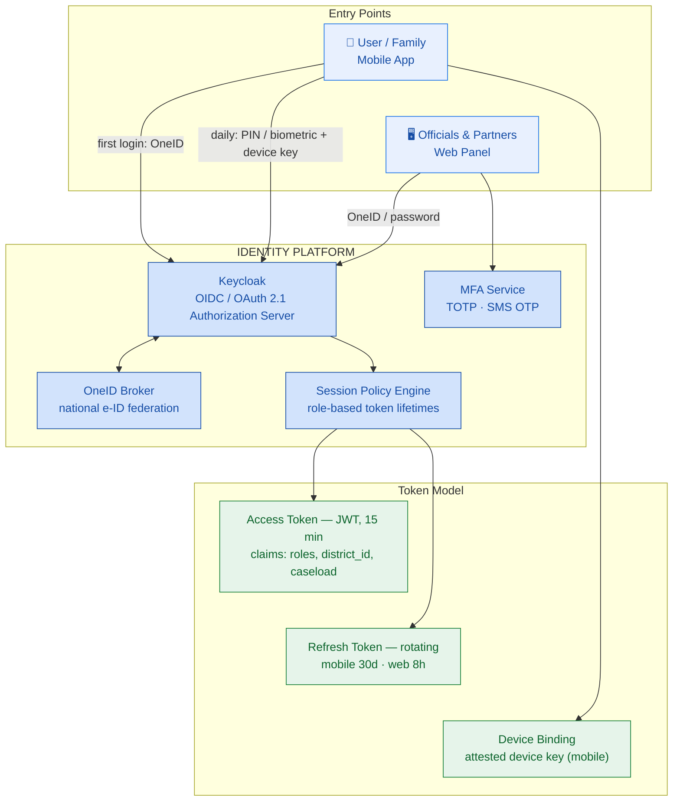
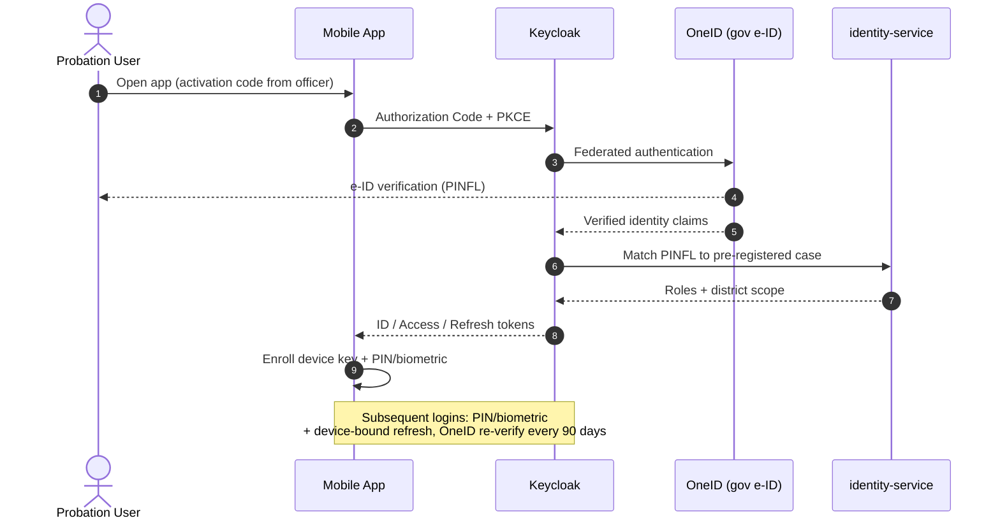
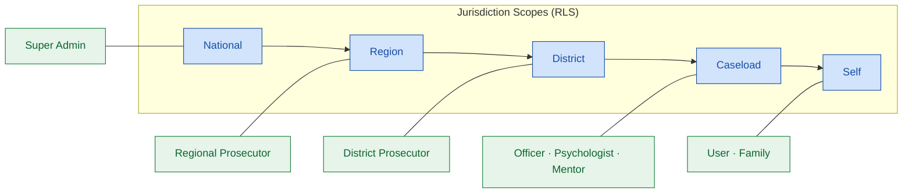
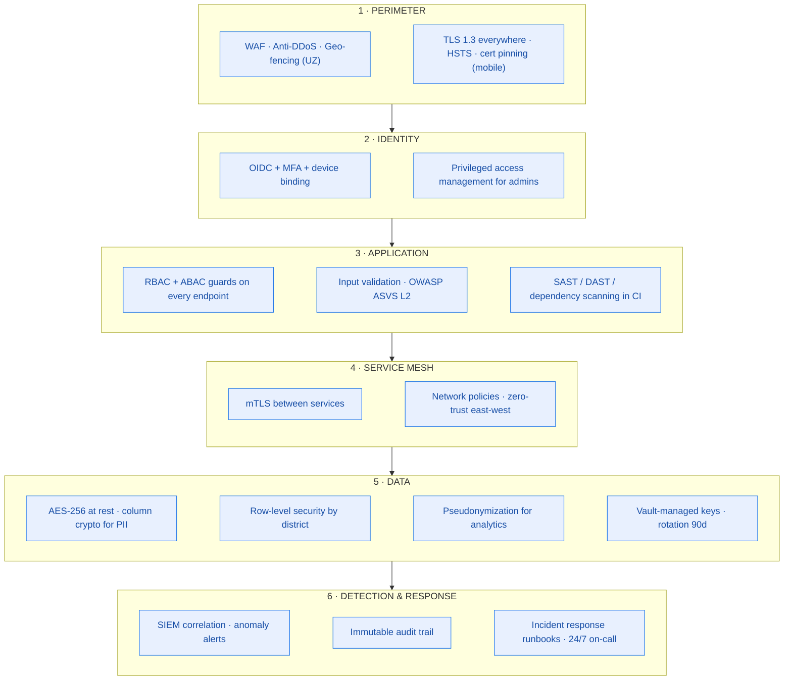
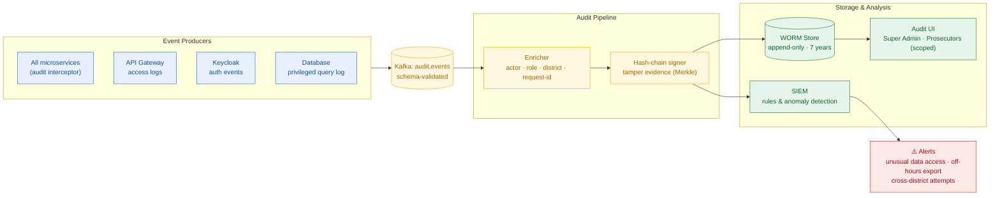
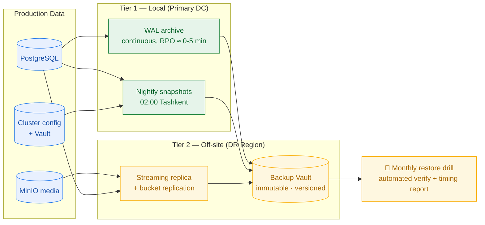
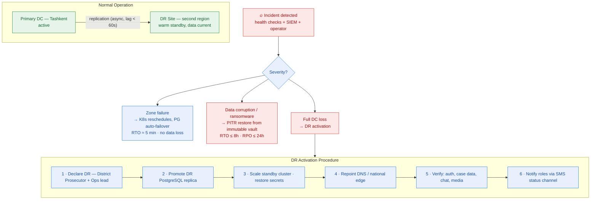

# 04 — Security, Identity & Resilience Architecture

Covers: Authentication · Permission Matrix · Security Architecture · Audit Log · Backup Strategy · Disaster Recovery

---

## 7. Authentication Architecture

Two entry classes: **citizens** (mobile, OneID-verified, then lightweight daily PIN/biometric)
and **officials/partners** (web, OneID or corporate credentials + mandatory MFA).

### Login sequence (user first-time)

---

## 8. Permission Matrix

Legend: **F** full · **M** manage (create/update within scope) · **R** read · **O** own data only · **–** none.
Scope column defines the jurisdiction boundary enforced by RLS.

| Module | Super Admin | Regional Prosecutor | District Prosecutor | Probation Officer | Psychologist | Mentor | Employer | Training Center | User | Family |
|---|---|---|---|---|---|---|---|---|---|---|
| **Scope** | National | Region | District | Caseload | Assigned users | Assigned users | Own org | Own org | Self | Linked user |
| User management | F | R | M | M | – | – | – | – | O | – |
| Case & plans | R | R | M | M | R | R | – | – | O | – |
| Tasks | R | R | M | M | M | R | – | – | O | – |
| Risk indicators | R | R | R | M | M | – | – | – | – | – |
| Goals & habits | – | – | R | R | R | R | – | – | F | R* |
| Mood tracker | – | – | – | R° | F | – | – | – | F | – |
| Psych. sessions | – | – | R° | R° | F | – | – | – | O | – |
| Courses | M | R | R | R | – | R | – | M | O | – |
| Digital library | M | R | R | R | R | R | – | – | F | – |
| Job center | M | R | R | M | – | R | M | – | F | – |
| CV builder | – | – | – | R | – | R | R† | – | F | – |
| Chat | M‡ | – | – | M | M | M | – | – | F | – |
| AI assistant | M | – | – | – | – | – | – | – | F | – |
| Calendar | R | R | M | M | M | M | – | R | O | – |
| Notifications | M | M | M | M | M | M | – | – | O | O |
| Analytics | F | R (region) | R (district) | R (caseload) | R (assigned) | – | – | R (own) | O | R* |
| Reports | F | M (region) | M (district) | M (caseload) | M (assigned) | – | – | – | – | – |
| Audit logs | F | R (region) | R (district) | – | – | – | – | – | – | – |
| System settings | F | – | – | – | – | – | – | – | – | – |

`R*` progress summary only, with user consent · `R°` attendance & risk level only, never clinical content ·
`R†` only CVs shared to their vacancy · `M‡` moderation policy, not message content by default.

---

## 9. Security Architecture (Defense in Depth)

**Compliance anchors:** Law of RUz "On Personal Data" (ZRU-547) — in-country storage;
O'zDSt cryptography alignment where mandated; OWASP ASVS L2; ISO 27001-aligned ISMS for operations.

---

## 26. Audit Log Architecture

Every security-relevant action — including **reads of personal data by officials** — produces an
immutable audit event. Officials know their access is logged; users can request their access history.

**Audited event classes:** authentication, role grants, case reads/writes, report exports,
chat moderation actions, AI escalations, configuration changes, backup/restore operations.

---

## 27. Backup Strategy

**3-2-1 rule:** 3 copies · 2 storage types · 1 off-site (DR region), with immutable tier for audit data.

| Dataset | Method | Frequency | Retention |
|---|---|---|---|
| PostgreSQL | WAL archiving + base backup | Continuous / nightly | 35 days PITR |
| PostgreSQL | Logical dump (per district) | Weekly | 12 months |
| MinIO media | Bucket replication + versioning | Continuous | 6 months versions |
| Audit WORM | Immutable object lock | Continuous | 7 years |
| K8s config / Vault | GitOps repo + sealed snapshots | On change / daily | 12 months |

---

## 28. Disaster Recovery Plan

| Objective | Pilot target | National target |
|---|---|---|
| RTO (full DC loss) | ≤ 4 hours | ≤ 30 minutes (hot standby) |
| RPO (full DC loss) | ≤ 15 minutes | ≤ 1 minute (sync options) |
| DR drill cadence | Quarterly tabletop + semi-annual failover | Quarterly full failover |
| Degraded mode | Mobile app offline-first: tasks, library, habits keep working; sync on recovery | Same + regional edge cache |
