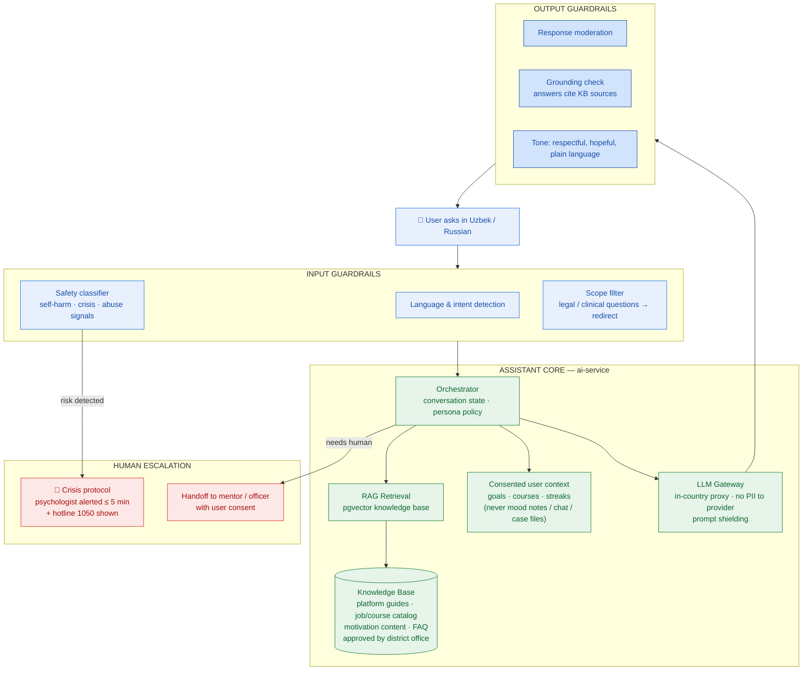
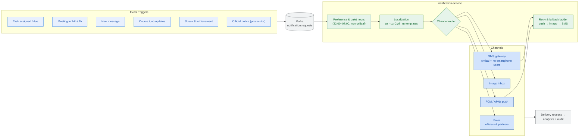
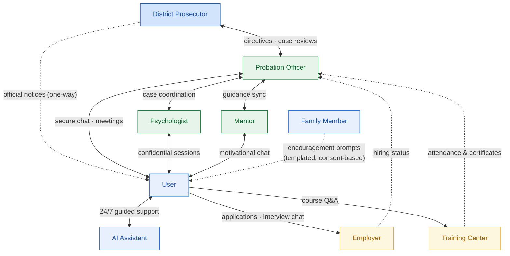
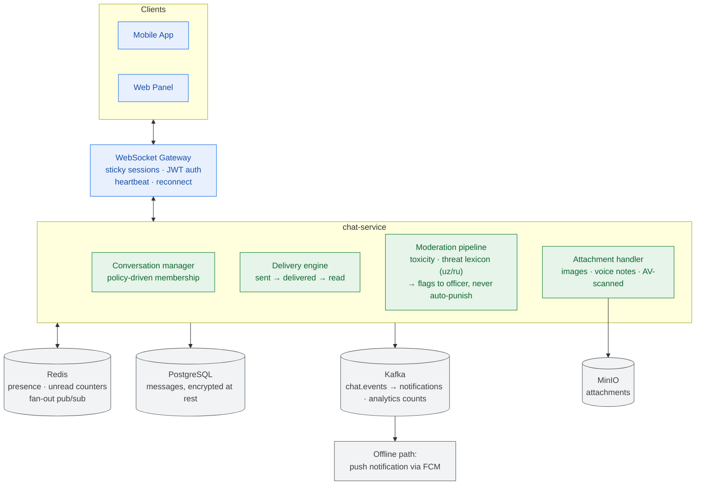
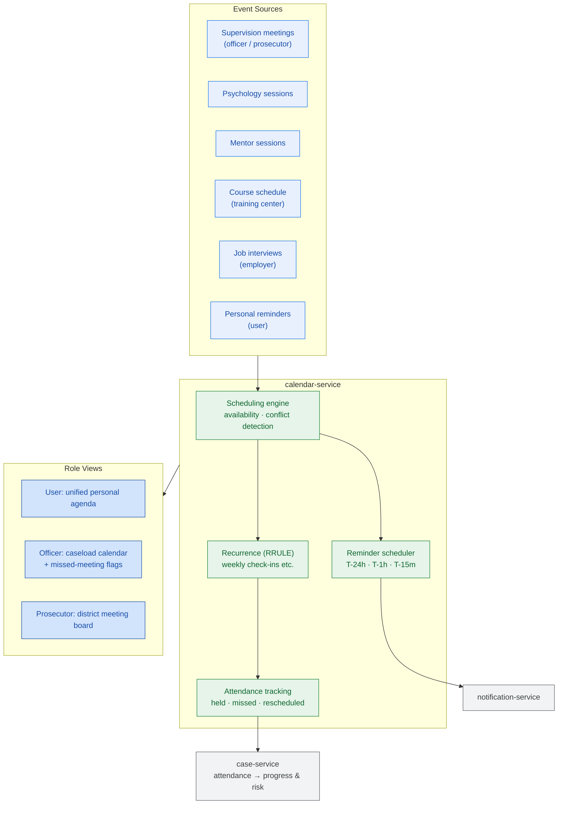

# 05 — Platform Services

Covers: AI Assistant · Notification Flow · Communication Flow · Chat System · Calendar

---

## 10. AI Assistant Architecture

The assistant ("Hamroh" — *companion*) motivates, explains, and guides. It operates behind strict
guardrails: **no legal advice, no clinical diagnosis, no case decisions** — and it escalates to
humans when risk signals appear.

**Assistant capabilities (pilot):** platform navigation help · interview & CV coaching ·
study-plan suggestions · motivational conversations · habit encouragement · meeting reminders Q&A ·
"what should I do today?" daily briefing.

---

## 11. Notification Flow

**Priority classes:** P1 official/legal (SMS + push, no quiet hours) · P2 schedule (push, respects
quiet hours) · P3 engagement (in-app digest, max 3/day to prevent fatigue).

---

## 17. Communication Flow (Who Talks to Whom)

**Communication policy**

| Rule | Rationale |
|---|---|
| No user↔user chat in pilot | Prevents negative peer pressure; group programs are moderated, roadmap Phase 2 |
| Psychologist channel is confidential | Officers/prosecutors see session attendance only |
| Family gets templated prompts, not free chat | Protects user privacy while enabling encouragement |
| All partner communication is job/course-scoped | No unsolicited contact with users |

---

## 18. Chat System Architecture

**Trust design:** users are told exactly which conversations are visible to whom. Mentor/officer
chats are subject to safeguarding review on flags; psychologist chats are confidential;
analytics receives message *counts*, never content.

---

## 22. Calendar Architecture

Missed **supervision** meetings raise a case flag automatically; missed **personal** items only
nudge the user — the calendar reinforces structure without becoming punitive.
