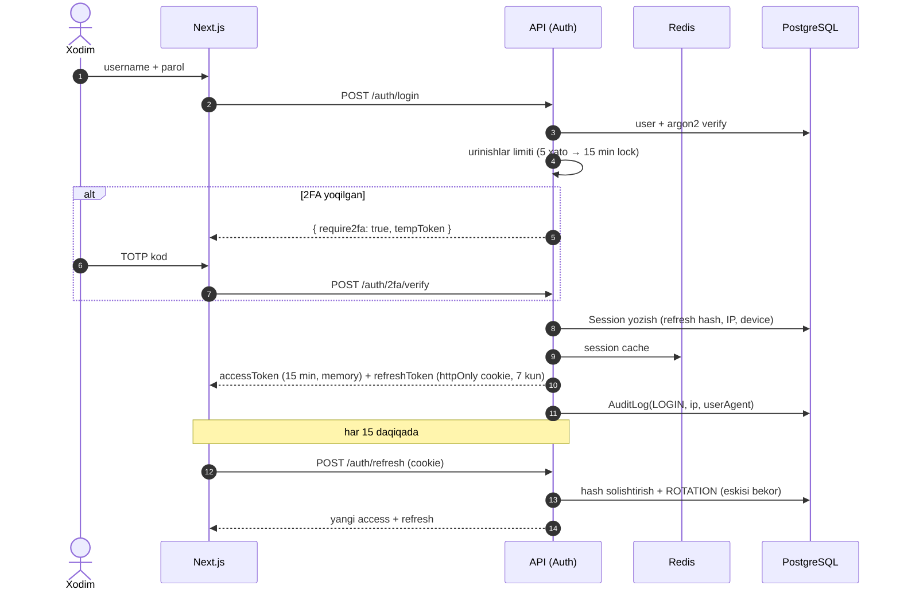

# 05 — Roles, Permissions & Security Architecture

---

## 1. Rollar va scope modeli

Ruxsat ikki o'qda ishlaydi:

1. **Permission** — *nima* qila oladi (`persons.create`, `tasks.approve`...).
2. **Scope** — *qaysi ma'lumot ustida* (respublika → viloyat → tuman → o'z caseload'i).

| Rol | Scope | Tavsif |
|---|---|---|
| **Super Admin** | Butun tizim | Texnik boshqaruv: foydalanuvchi/rol/sozlamalar. Odatda operativ ma'lumot bilan ishlamaydi |
| **Respublika** | Barcha viloyatlar | Respublika rahbariyati: to'liq ko'rish, topshiriq berish, hisobot |
| **Viloyat** | O'z viloyati | Viloyat rahbari: tumanlar nazorati, topshiriq, tasdiqlash |
| **Tuman** | O'z tumani | Tuman prokurori (rahbar): tuman ma'lumotlari, topshiriq yaratish/tasdiqlash |
| **Prokuror** | O'z caseload'i (biriktirilgan shaxslar) + tuman ko'rish | Operativ ish: shaxslar, tashriflar, muammolar, topshiriq bajarish |
| **Operator** | O'z tumani | Ma'lumot kiritish: shaxs qo'shish/tahrirlash, hujjat yuklash, Excel import. Tasdiqlash huquqi yo'q |
| **Kuzatuvchi** | Tayinlangan scope | Faqat o'qish (read-only): dashboard, ro'yxatlar, analitika. Export ham cheklangan |

Scope amalga oshirilishi: `users.regionId/districtId` + Repository qatlamida majburiy `applyScope()` filtri. Prokuror uchun qo'shimcha: `persons.prosecutorId = user.id OR districtId = user.districtId (read-only)`.

## 2. To'liq Permission Matrix

Belgilar: ✅ to'liq · 👁 faqat ko'rish · 🔸 faqat o'z scope/o'zi yaratganlari · ❌ yo'q

| Permission | Super Admin | Respublika | Viloyat | Tuman | Prokuror | Operator | Kuzatuvchi |
|---|---|---|---|---|---|---|---|
| **Dashboard** ko'rish | ✅ | ✅ | 🔸 | 🔸 | 🔸 | 🔸 | 👁 |
| **Persons** ko'rish | ✅ | ✅ | 🔸 | 🔸 | 🔸 | 🔸 | 👁 |
| Persons yaratish | ❌ | ✅ | ✅ | ✅ | ✅ | ✅ | ❌ |
| Persons tahrirlash | ❌ | ✅ | 🔸 | 🔸 | 🔸 | 🔸 | ❌ |
| Persons o'chirish (soft) | ✅ | ✅ | 🔸 | 🔸 | ❌ | ❌ | ❌ |
| Persons arxivlash/chiqarish | ❌ | ✅ | 🔸 | 🔸 | ❌ | ❌ | ❌ |
| Status o'zgartirish (workflow) | ❌ | ✅ | 🔸 | 🔸 | 🔸 | ❌ | ❌ |
| **Problems** yaratish/tahrirlash | ❌ | ✅ | 🔸 | 🔸 | 🔸 | 🔸 | ❌ |
| Problems hal qilish (resolve) | ❌ | ✅ | 🔸 | 🔸 | 🔸 | ❌ | ❌ |
| **Tasks** yaratish (topshiriq berish) | ❌ | ✅ | 🔸 | 🔸 | ❌ | ❌ | ❌ |
| Tasks bajarish (submit) | ❌ | ❌ | ❌ | ❌ | 🔸 | 🔸 | ❌ |
| Tasks tasdiqlash/rad etish | ❌ | ✅ | 🔸 | 🔸 | ❌ | ❌ | ❌ |
| **Visits** yaratish | ❌ | ❌ | 🔸 | 🔸 | 🔸 | 🔸 | ❌ |
| Visits ko'rish | ✅ | ✅ | 🔸 | 🔸 | 🔸 | 🔸 | 👁 |
| **Documents** yuklash/versiya | ❌ | ✅ | 🔸 | 🔸 | 🔸 | 🔸 | ❌ |
| Documents yuklab olish | ✅ | ✅ | 🔸 | 🔸 | 🔸 | 🔸 | 👁 |
| **Excel** import | ❌ | ❌ | ❌ | 🔸 | ❌ | 🔸 | ❌ |
| Excel export | ✅ | ✅ | 🔸 | 🔸 | 🔸 | ❌ | ❌ |
| **Analytics/KPI** ko'rish | ✅ | ✅ | 🔸 | 🔸 | 🔸(o'z KPI) | ❌ | 👁 |
| **AI** foydalanish | ❌ | ✅ | ✅ | ✅ | ✅ | ❌ | ❌ |
| **Audit** ko'rish | ✅ | ✅ | 🔸 | 🔸 | ❌ | ❌ | ❌ |
| **Monitoring Center** | ✅ | ✅ | 🔸 | 🔸 | ❌ | ❌ | 👁 |
| **Users** boshqarish | ✅ | 🔸(viloyat adminlari) | 🔸(tuman xodimlari) | 🔸(o'z xodimlari) | ❌ | ❌ | ❌ |
| **Roles/Permissions** boshqarish | ✅ | ❌ | ❌ | ❌ | ❌ | ❌ | ❌ |
| **Geo/lug'atlar** boshqarish | ✅ | ✅ | ❌ | ❌ | ❌ | ❌ | ❌ |
| **Security** (IP, sessiyalar) | ✅ | ❌ | ❌ | ❌ | ❌ | ❌ | ❌ |
| **Settings** (logotip, tashkilot) | ✅ | ❌ | ❌ | ❌ | ❌ | ❌ | ❌ |

> Matritsa `permissions` + `role_permissions` jadvallarida saqlanadi (seed orqali). Super Admin UI'dan rol-permission bog'lanishini o'zgartira oladi; har o'zgarish `PERMISSION_CHANGE` sifatida auditga tushadi.

## 3. Autentifikatsiya arxitekturasi

**Token qoidalari**

| Element | Qiymat |
|---|---|
| Access token | JWT (RS256), 15 daqiqa, faqat xotirada (localStorage'da EMAS) |
| Refresh token | Tasodifiy 256-bit, hash holida DB'da, httpOnly+Secure+SameSite=Strict cookie, rotation + reuse-detection (qayta ishlatilsa — barcha sessiyalar bekor) |
| JWT payload | `sub`, `role`, `regionId`, `districtId`, `sessionId` — permissionlar tokenga yozilmaydi (Redis cache'dan) |
| Parol | Argon2id, min 12 belgi, murakkablik siyosati, parol tarixi (oxirgi 5 ta takrorlanmaydi) |
| 2FA | TOTP (RFC 6238); rahbar rollar uchun majburiy; secret AES-256-GCM bilan shifrlangan |

## 4. Security qatlamlari (defense in depth)

| Qatlam | Chora |
|---|---|
| **Tarmoq** | Faqat ichki tarmoq/VPN; Nginx IP whitelist (`ip_whitelist` jadvalidan sinxron); TLS 1.2+; HSTS |
| **Rate limiting** | Nginx (umumiy) + NestJS Throttler: login 5/min/IP, API 100/min/user, export/AI alohida kvota |
| **Session control** | Bir foydalanuvchida max N faol sessiya (default 3); "Qurilmalarim" sahifasida masofadan uzish; admin istalgan sessiyani bekor qiladi |
| **Device tracking** | Har sessiyada IP + User-Agent + device nomi; yangi qurilmadan kirishda bildirishnoma |
| **Input** | Zod/class-validator whitelist; Prisma (SQL injection yo'q); fayl: MIME + magic-bytes + hajm limiti + nom sanitizatsiya |
| **Output** | React escaping; CSP (self + Yandex Maps domenlari); X-Frame-Options DENY; fayllar presigned URL (5 min TTL) orqali |
| **Encryption** | Uzatishda TLS; diskda LUKS (server) + DB muhim ustunlar (2FA secret) app-level AES-256-GCM; backuplar shifrlangan |
| **Audit** | Har mutatsiya AuditInterceptor orqali old/new bilan; append-only; export/download ham log |
| **Backup/Restore** | Kunlik pg_dump (02:00) + MinIO mirror → alohida server; 30 kun retention; haftalik avtomatik restore-test staging'da; RPO ≤ 24h, RTO ≤ 4h |

## 5. Tahdid modeli (qisqacha)

| Tahdid | Qarshi chora |
|---|---|
| O'g'irlangan parol | 2FA, IP whitelist, yangi qurilma bildirishnomasi, session limit |
| Ichki suiiste'mol (ma'lumotni ko'p ko'rish/export) | Scope-filter, export kvota + audit, `VIEW_SENSITIVE` log, rahbar audit hisobotlari |
| Token o'g'irlash (XSS) | httpOnly cookie, access faqat xotirada, CSP, qisqa TTL |
| CSRF | SameSite=Strict, custom header talab |
| Ma'lumot sizishi (fayl URL) | Private bucket, presigned URL qisqa TTL, download audit |
| Backup o'g'irlanishi | Shifrlangan backup, alohida kalit boshqaruvi |
