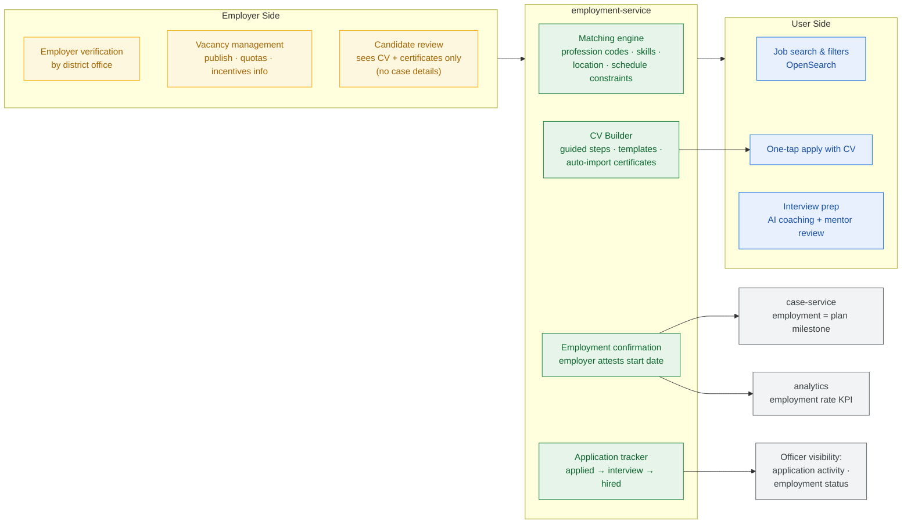
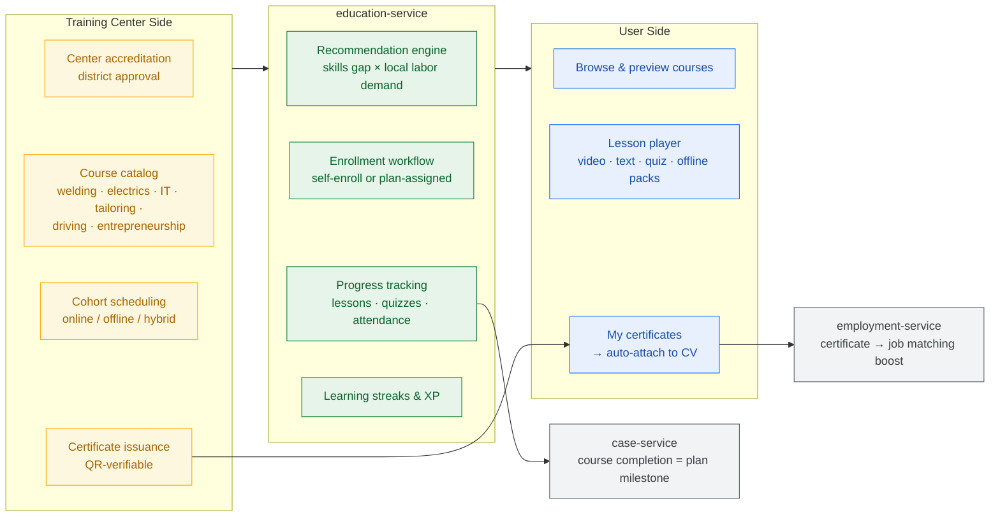
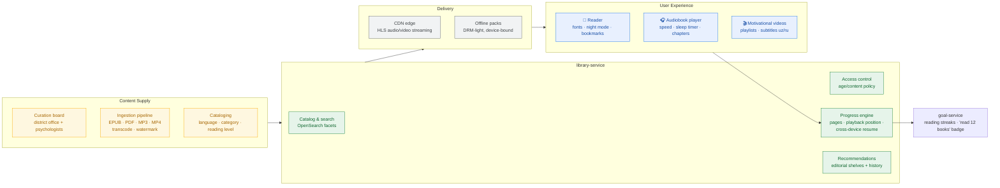
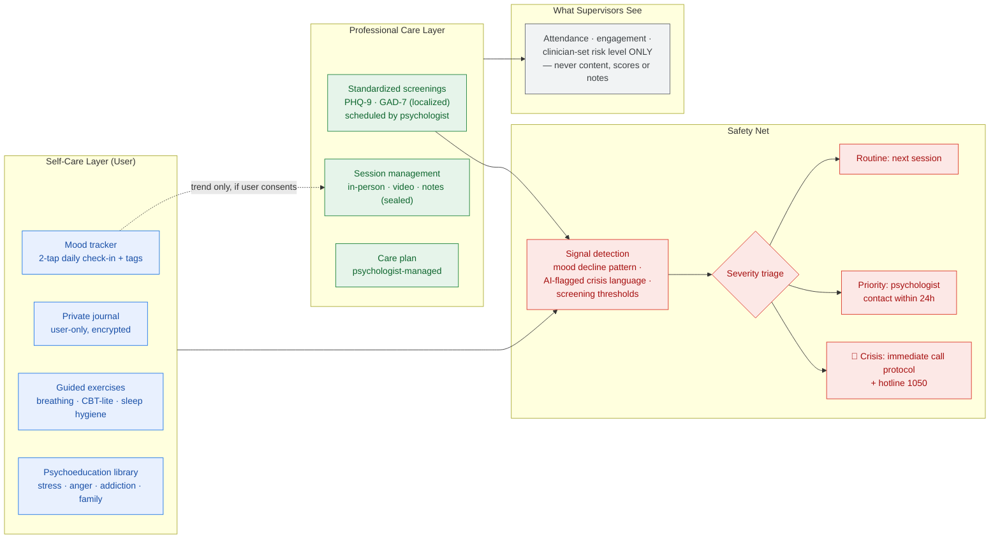

# 06 — Rehabilitation Modules

Covers: Employment · Education · Digital Library · Goal Tracking · Mental Health

---

## 19. Employment Module Architecture

The economic engine of reintegration: verified employers, skill-matched vacancies, and a
dignified CV that presents the person's future, not their past.

**Dignity safeguards:** employers never see probation case data — only what the user chooses to
share in the CV; the platform brands candidates as "Yangi Hayot program participants" only with
user consent.

---

## 20. Education Module Architecture

---

## 21. Digital Library Architecture

**Pilot catalog target:** 200 books (uz/ru), 60 audiobooks, 100 motivational videos, 12
profession explainer series — reviewed by the curation board before publication.

---

## 23. Goal Tracking Architecture (Goals · Habits · Achievements)

```mermaid
flowchart LR
    subgraph SET["Goal Setting"]
        OFFICIAL["Plan goals<br/>from reintegration plan<br/>(officer-agreed)"]
        PERSONAL["Personal goals<br/>user-defined, private by default"]
        SMART["SMART decomposition<br/>goal → milestones → weekly actions"]
    end

    subgraph TRACK["goal-service Engines"]
        HABIT["Habit engine<br/>daily/weekly schedule ·<br/>streak calculation · grace days"]
        PROGE["Progress engine<br/>auto-progress from events:<br/>lesson done · pages read ·<br/>application sent · session attended"]
        XP["Gamification engine<br/>XP · levels · badges<br/>bronze → silver → gold"]
    end

    subgraph FEEDBACK["Feedback Loops"]
        DAILYV["Daily view<br/>today's 3 focus actions"]
        CELE["Celebrations<br/>confetti · certificates · milestone cards"]
        NUDGE["Smart nudges<br/>streak-at-risk · comeback support<br/>(never shaming)"]
    end

    KAFG[("Kafka progress.events")]
    RISKG["risk-service<br/>engagement drop = early-warning signal"]
    REPG["Officer/prosecutor dashboards<br/>plan-goal progress only"]

    SET --> TRACK --> FEEDBACK
    TRACK --> KAFG --> RISKG & REPG

    classDef s fill:#e8f0fe,stroke:#1a73e8,color:#174ea6
    classDef t fill:#e6f4ea,stroke:#188038,color:#0d652d
    classDef f fill:#d2e3fc,stroke:#174ea6,color:#174ea6
    classDef k fill:#f1f3f4,stroke:#5f6368,color:#3c4043
    class OFFICIAL,PERSONAL,SMART s
    class HABIT,PROGE,XP t
    class DAILYV,CELE,NUDGE f
    class KAFG,RISKG,REPG k
```

**Behavioral design:** losing a streak triggers *comeback* framing ("start a new streak today"),
not failure messaging. Personal goals stay private; only plan goals surface to supervisors.

---

## 24. Mental Health Module

The clinically sensitive core. Confidentiality is architectural, not procedural.

**Clinical governance:** screenings and protocols approved by a licensed supervising psychologist;
crisis protocol co-designed with the regional mental-health service; users are told at onboarding
exactly what is and is not shared.
