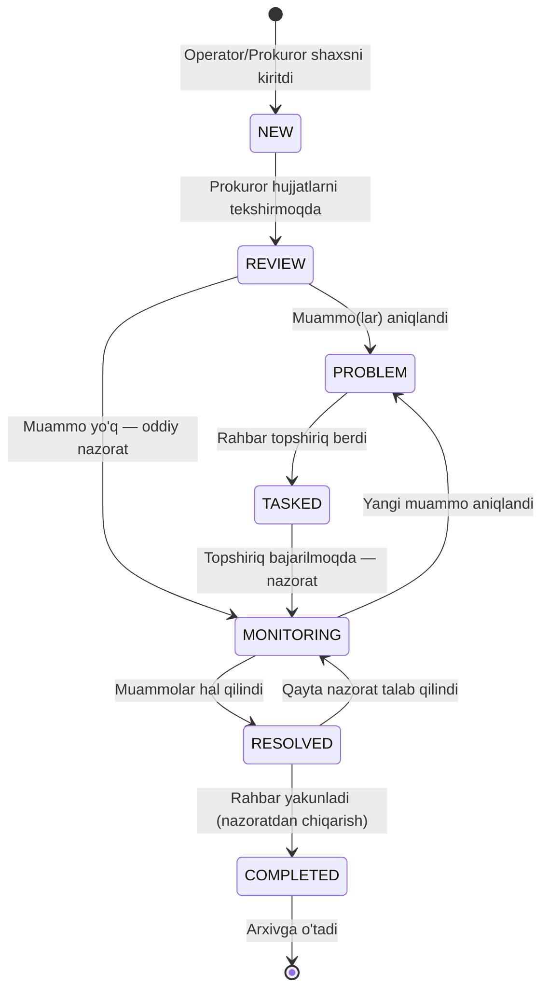
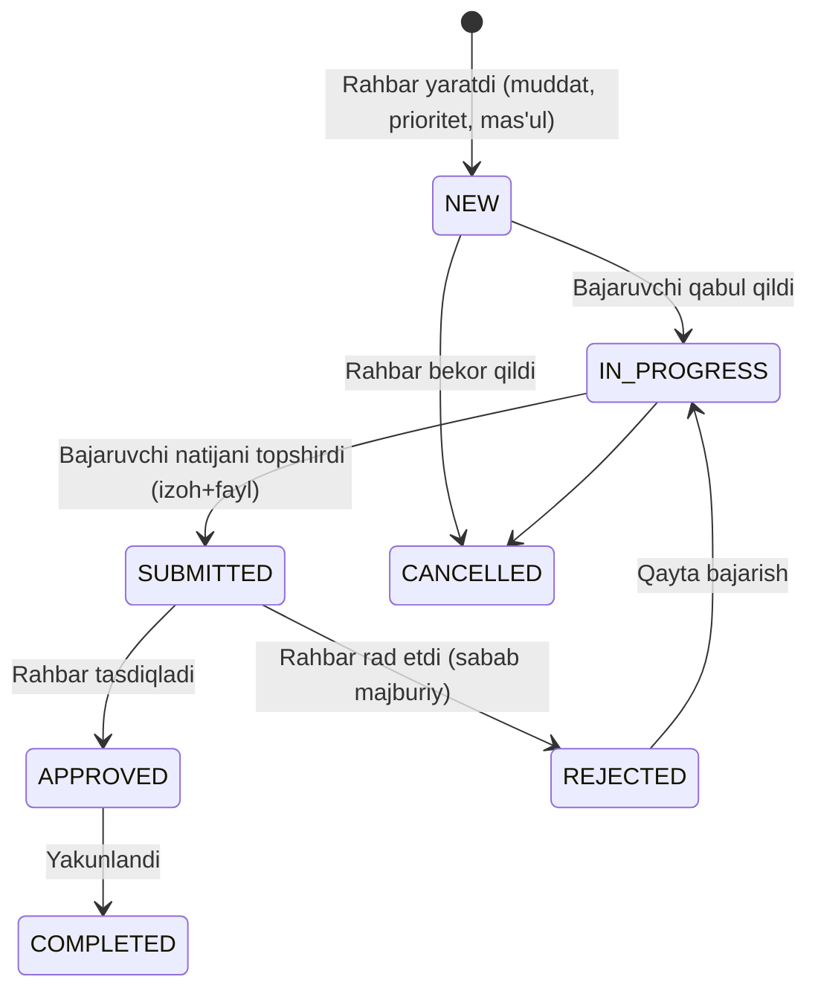
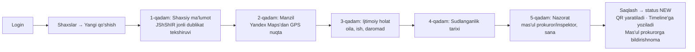

# 06 — Workflow & User Flows

---

## 1. Asosiy ish jarayoni (Person Workflow)

Shaxs karточkasi 7 bosqichli hayot siklidan o'tadi. Har o'tish `person_status_history` + `timeline_events` ga yoziladi; kim va qachon o'tkazgani majburiy.

**O'tish qoidalari**

| O'tish | Kim | Shart |
|---|---|---|
| NEW → REVIEW | Prokuror/Tuman | Asosiy maydonlar to'liq |
| REVIEW → PROBLEM | Prokuror+ | Kamida 1 ochiq muammo yaratilgan |
| PROBLEM → TASKED | Tuman/Viloyat/Respublika | Muammoga bog'liq topshiriq yaratilgan |
| MONITORING → RESOLVED | Tuman+ | Barcha muammolar RESOLVED, ochiq topshiriq yo'q |
| RESOLVED → COMPLETED | Tuman+ (rahbar tasdig'i) | Yakuniy xulosa hujjati yuklangan |
| COMPLETED | avtomatik | `supervisedTo` to'ldiriladi, `isArchived = true` |

## 2. Topshiriq (Task) workflow

Muddati o'tsa: status o'zgarmaydi, lekin `overdue` belgisi + eskalatsiya bildirishnomasi (bajaruvchi → 1 kun oldin; rahbar → muddat o'tganda).

## 3. Muammo (Problem) workflow

`OPEN → IN_PROGRESS → ON_CONTROL → RESOLVED` (yoki `REJECTED` — asossiz deb topilsa, sabab majburiy). Muddat yaqinlashganda mas'ulga, o'tganda rahbarga eskalatsiya.

## 4. User Flows (asosiy foydalanuvchi oqimlari)

### 4.1 Operator: yangi shaxsni ro'yxatga olish

### 4.2 Prokuror: tashrif qayd etish

Login → Shaxs profili → "Tashrif qo'shish" → sana/vaqt, GPS (brauzerdan avtomatik), foto/audio/video yuklash, xulosa, keyingi tashrif sanasi → Saqlash → Timeline yangilanadi, keyingi tashrif uchun Reminder avtomatik yaratiladi, KPI hisobiga qo'shiladi.

### 4.3 Rahbar (Tuman): muammodan topshiriqgacha

Dashboard'da "Eng muammoli hududlar" → muammo ro'yxati → muammoni ochish → "Topshiriq yaratish" (mas'ul, muddat, prioritet, izoh, fayl) → bajaruvchiga bildirishnoma (in-app + Telegram) → bajaruvchi SUBMIT qiladi → rahbarga bildirishnoma → APPROVE/REJECT → APPROVED bo'lsa muammo ON_CONTROL→RESOLVED tekshiruvi taklif qilinadi.

### 4.4 Viloyat rahbari: haftalik nazorat

Login → Dashboard (viloyat scope) → muddati o'tgan vazifalar/tashriflar widgetlari → tuman kesimida comparison → sust xodim KPI profili → AI'dan "60 kun tashrif qilinmagan shaxslar" so'rovi → natijadan ommaviy topshiriq yaratish → Excel hisobot export.

### 4.5 Excel import (Operator)

Template yuklab olish → to'ldirilgan faylni yuklash → worker: validatsiya + JShShIR dublikat aniqlash → natija ekrani: N ta muvaffaqiyatli / M ta xato (qator-ma-qator xato hisoboti yuklab olinadi) / K ta dublikat (ko'rib chiqish ro'yxati) → tasdiqlash → import → AuditLog(IMPORT).

### 4.6 Hujjat QR tekshiruvi

Hujjat chop etilganda QR bosiladi → xodim `verify/[qr]` sahifasini ochadi (ichki tarmoqda) → tizim hujjat nomi, versiyasi, kim/qachon yaratgani, haqiqiyligini ko'rsatadi. QR token — taxmin qilib bo'lmaydigan UUID; sahifa autentifikatsiya talab qiladi.

### 4.7 Super Admin: yangi xodim qo'shish

Boshqaruv → Foydalanuvchilar → Yaratish (FIO, lavozim, rol, scope: viloyat/tuman) → vaqtinchalik parol generatsiya → birinchi kirishda parol almashtirish majburiy + 2FA o'rnatish (rahbar rollar uchun majburiy) → AuditLog.

### 4.8 Monitoring Center (katta ekran)

Kuzatuvchi/rahbar `monitoring` sahifani katta ekranda ochadi → fullscreen qorong'u rejim → 30 soniyalik aylanish: jonli statistika → viloyatlar xaritasi (heatmap) → KPI reyting → faol ogohlantirishlar (muddati o'tganlar, CRITICAL risk) → WS orqali real vaqt yangilanish.

## 5. Eskalatsiya matritsasi

| Hodisa | Kimga | Qachon | Kanal |
|---|---|---|---|
| Task muddatiga 1 kun | Bajaruvchi | D-1, 09:00 | In-app + Telegram |
| Task muddati o'tdi | Bajaruvchi + yaratuvchi rahbar | D+0 | In-app + Telegram |
| Task 3 kun kechikdi | Yuqori rahbar (tuman→viloyat) | D+3 | In-app + Telegram + Email |
| Tashrif rejasi o'tdi | Mas'ul prokuror | D+0 | In-app + Telegram |
| Muammo muddati o'tdi | Mas'ul + rahbar | D+0 | In-app + Telegram |
| Risk CRITICAL ga ko'tarildi | Mas'ul prokuror + tuman rahbari | Darhol | Barcha kanallar |
| Shaxs tug'ilgan kuni | Mas'ul prokuror | D-0, 08:00 | In-app |
