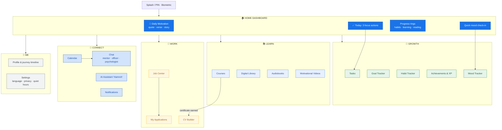
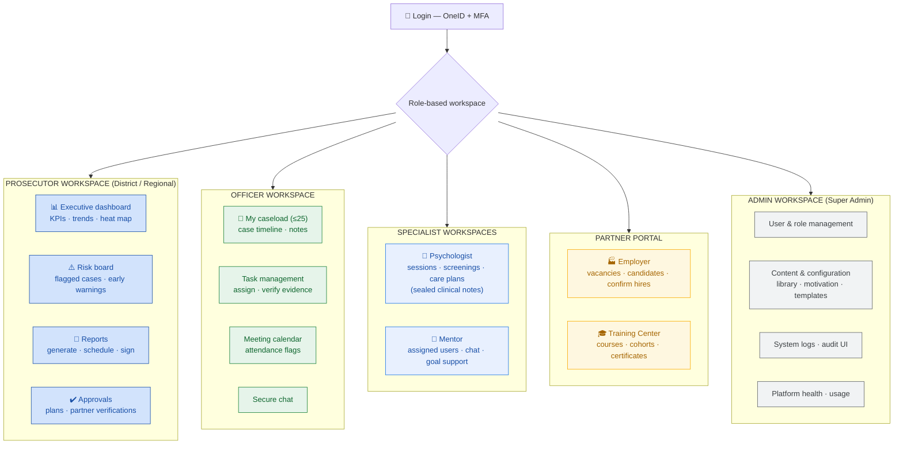
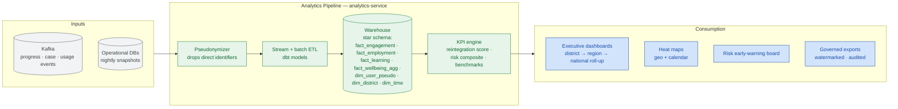
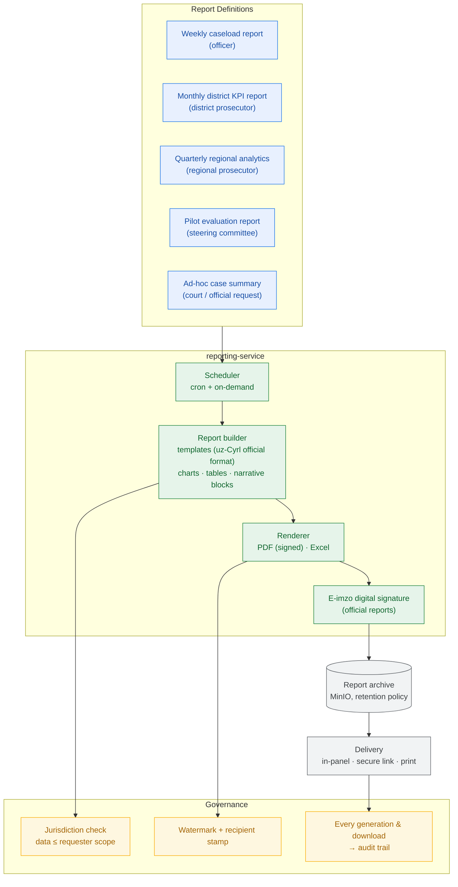

# 07 — Applications, Analytics & Reporting

Covers: Analytics Dashboard · Mobile Application Flow · Web Admin Panel Flow · Reporting System
Plus: full module specifications for the User App and the Admin Dashboard.

---

## 13. Mobile Application Flow (User App)

### User application — module specification

| Module | Purpose | Key features |
|---|---|---|
| Home Dashboard | Daily anchor | Motivation card, 3 focus actions, progress rings, streak flame |
| Daily Motivation | Positive start | Curated quotes/stories, save favorites, share to mentor |
| Tasks | Structure | Official tasks + self tasks, due dates, evidence upload |
| Achievements | Momentum | XP, levels, badges (bronze/silver/gold), milestone cards |
| Goal Tracker | Direction | Plan goals + private goals, SMART milestones, progress % |
| Habit Tracker | Discipline | Daily/weekly habits, streaks with grace day, calendar heat view |
| Mood Tracker | Self-awareness | 2-tap check-in, tags, private notes, personal trend chart |
| Courses | Skills | Catalog, lesson player, quizzes, offline packs, certificates |
| Digital Library | Growth | Reader with night mode, bookmarks, reading goals |
| Audiobooks | Accessibility | Player with speed/sleep timer, chapter resume |
| Motivational Videos | Inspiration | Playlists, subtitles uz/ru, success stories of alumni |
| Job Center | Livelihood | Search/filter, one-tap apply, application status, saved jobs |
| CV Builder | Presentation | Guided wizard, templates, auto-import certificates, PDF export |
| Chat | Human support | Mentor/officer/psychologist channels, voice notes, read receipts |
| AI Assistant | 24/7 companion | Guided help, coaching, daily briefing, crisis-safe escalation |
| Calendar | Reliability | Unified agenda, reminders, reschedule requests |
| Notifications | Awareness | Inbox, priority levels, quiet hours |
| Profile | Identity | Journey timeline, documents, certificates wallet |
| Settings | Control | Language (uz/uz-Cyrl/ru), privacy consents, accessibility, PIN |

---

## 14. Web Admin Panel Flow (Professional Roles)

### Admin dashboard — feature specification

| Feature | Description | Primary roles |
|---|---|---|
| Charts | Trend lines: engagement, employment, course completion, mood index (aggregated) | Prosecutors, Admin |
| User statistics | Active users, DAU/WAU, module adoption, cohort comparisons | Prosecutors, Admin |
| Progress reports | Per-case and aggregate plan-goal progress, milestone timeline | Officer, Prosecutors |
| Heat maps | Mahalla-level engagement & employment map of district; calendar heat of activity | Prosecutors |
| Risk indicators | Composite early-warning score: engagement drop, missed meetings, mood trend (aggregated), officer flags | Officer, Prosecutors |
| Task completion | Completion rates by user, type and officer; overdue queue | Officer, Prosecutors |
| Meeting calendar | District meeting board, attendance analytics, no-show alerts | Officer, Prosecutors |
| Analytics | Drill-down explorer with export (jurisdiction-scoped) | Prosecutors, Admin |
| Notifications | Broadcast official notices, template management, delivery stats | Prosecutors, Admin |
| System logs | Audit trail viewer, security alerts, session history | Admin, Prosecutors (scoped) |

---

## 12. Analytics Dashboard Architecture

**North-star KPIs (pilot):** ≥70% weekly active engagement · ≥40% employed or in training by
month 6 · ≥60% course completion · measurable mood-index improvement · zero probation
violations among top-engagement quartile (hypothesis to validate).

**Small-cohort privacy rule:** with ~50 users, any aggregate slice smaller than 5 people is
suppressed to prevent indirect identification.

---

## 25. Reporting System

**Official format note:** prosecutorial reports render in the state document format (Uzbek
Cyrillic headers, official seals block, E-imzo signature line) so platform output slots directly
into existing government workflows.
