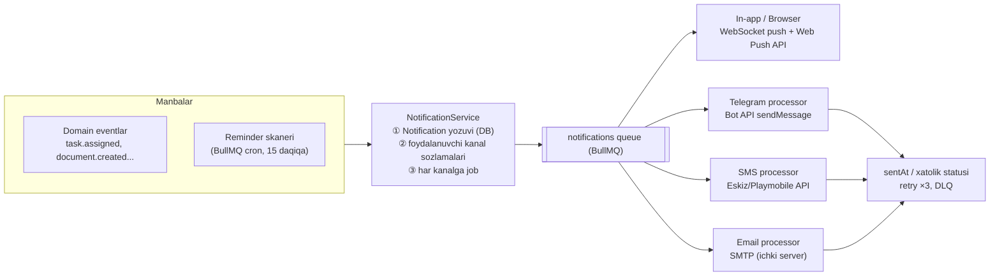
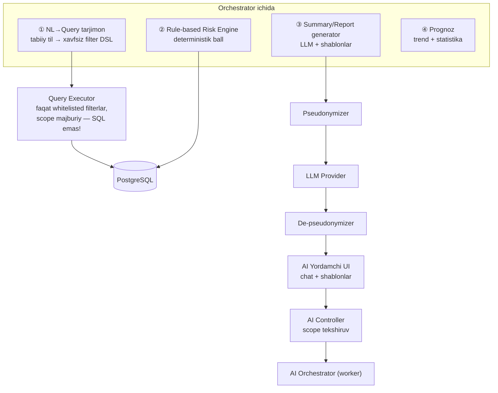

# 07 — Notification Architecture & Smart AI Module

---

## 1. Notification Architecture

### 1.1 Umumiy oqim

### 1.2 Kanallar

| Kanal | Texnika | Izoh |
|---|---|---|
| **In-app** | `notifications` jadvali + WS `notifications:{userId}` | Har doim yoziladi (asosiy manba) |
| **Browser Push** | Web Push API (VAPID) | Brauzer yopiq bo'lsa ham; ruxsat foydalanuvchidan |
| **Telegram** | Rasmiy bot; xodim profildan `/start <linkCode>` orqali bog'laydi (`telegram_links`) | Eng tezkor kanal; tarkibda shaxsiy ma'lumot minimal — havola tizimga |
| **SMS** | Mahalliy gateway (Eskiz/Playmobile) | Faqat kritik triggerlar (kvota nazorati) |
| **Email** | Idoraviy SMTP | Haftalik digest + eskalatsiyalar |

**Maxfiylik qoidasi:** tashqi kanallarga (Telegram/SMS/Email) shaxs JShShIR/manzil kabi ma'lumot yuborilmaydi — faqat "Sizga yangi topshiriq berildi" + tizim havolasi.

### 1.3 Triggerlar

| Trigger | Turi | Kanallar (default) |
|---|---|---|
| Vazifa tayinlandi | Event | In-app + Telegram |
| Vazifa muddati (D-1, D+0, D+3) | Cron | In-app + Telegram (+Email D+3) |
| Tashrif muddati (D-1, D+0) | Cron | In-app + Telegram |
| Muammo muddati | Cron | In-app + Telegram |
| Yangi hujjat | Event | In-app |
| Yangi izoh | Event | In-app |
| Tug'ilgan kun | Cron (kunlik 08:00) | In-app |
| Risk CRITICAL | Event | Barcha kanallar |
| Yangi qurilmadan kirish | Event | In-app + Telegram |

Foydalanuvchi `notification_settings` orqali kanalni o'chira oladi (kritik xavfsizlik bildirishnomalaridan tashqari).

## 2. Smart Reminder

Reminder — kelajakdagi sanaga bog'langan yozuv (`reminders`), skaner topib notification'ga aylantiradi:

1. Yozuv manbalari: tashrifda `nextVisitAt` kiritilganda; task/problem deadline yaratilganda (D-1 va D+0 uchun); shaxs tug'ilgan kuni (yillik generatsiya); hujjat amal muddati.
2. Cron (har 15 daq): `remindAt <= now() AND firedAt IS NULL` → notification dispatch → `firedAt` belgilanadi.
3. Idempotent — bir reminder faqat bir marta otiladi; muddat surilsa reminder qayta hisoblanadi.

## 3. Smart AI Module Architecture

### 3.1 Tamoyillar

1. **AI — yordamchi**: risk ball va tavsiyalar *taklif*; yuridik qarorni faqat xodim qabul qiladi (human-in-the-loop).
2. **Ma'lumot chiqmaydi**: agar tashqi LLM ishlatilsa — shaxsiy identifikatorlar (FIO, JShShIR, pasport, telefon, manzil) so'rovdan **pseudonymize** qilinadi (`Shaxs-4821`); javob qaytgach lokalda qayta bog'lanadi. Ideal holat — mamlakat ichida joylashgan LLM.
3. **To'liq audit**: har so'rov/javob `ai_requests` da saqlanadi.

### 3.2 Arxitektura

### 3.3 Imkoniyatlar

| Funksiya | Yondashuv |
|---|---|
| **Risk Score (0–100)** | Asosiy hisob — **deterministik qoidalar** (tushuntiriladigan): tashrif kechikishi, ochiq muammolar soni/og'irligi, ishsizlik, retsidiv tarixi, muddati o'tgan topshiriqlar. Har omil vazni sozlamalarda; natija `risk_score_history` ga omillari bilan yoziladi. LLM emas — chunki huquqiy kontekstda izohlanuvchanlik shart |
| **Tabiiy tildagi so'rov** | "Oxirgi 60 kun tashrif qilinmagan shaxslar", "Band bo'lmagan yoshlarni chiqar" → LLM so'rovni **structured filter DSL** ga o'giradi (masalan `{lastVisitOlderThanDays: 60}`), tizim uni oddiy Prisma so'rov sifatida bajaradi. LLM hech qachon to'g'ridan-to'g'ri SQL yozmaydi va ma'lumotga tegmaydi |
| **Shaxs tahlili / xulosa** | Timeline + muammolar + tashriflar → pseudonym qilingan kontekst → LLM strukturali xulosa yozadi → xodim tahrirlaydi va tasdiqlaydi |
| **Hisobot yaratish** | Davr/hudud statistikasi (SQL agregatlar) → LLM matnli tahliliy qism → Word/PDF shablon |
| **Tavsiyalar** | Qoida + LLM aralash: "Bu shaxsga 45 kun tashrif yo'q — tashrif rejalashtiring", "Bandlik muammosi 30 kun ochiq — mas'ul tashkilotga eskalatsiya" |
| **Muammo prognozi** | Tarixiy statistika (hudud/mavsum/tur kesimida trend) — klassik statistika, LLM faqat izohlaydi |

### 3.4 Tayyor so'rov shablonlari (UI'da)

- Oxirgi N kun tashrif qilinmagan shaxslar
- Band bo'lmagan (ishsiz) yoshlar (18–30)
- Muddati o'tgan topshiriqlar — xodim kesimida
- CRITICAL/HIGH risk, oxirgi 30 kunda ko'tarilganlar
- Hal qilinmagan muammolar — tashkilot kesimida
- Nazorat muddati tugashiga 30 kun qolganlar
