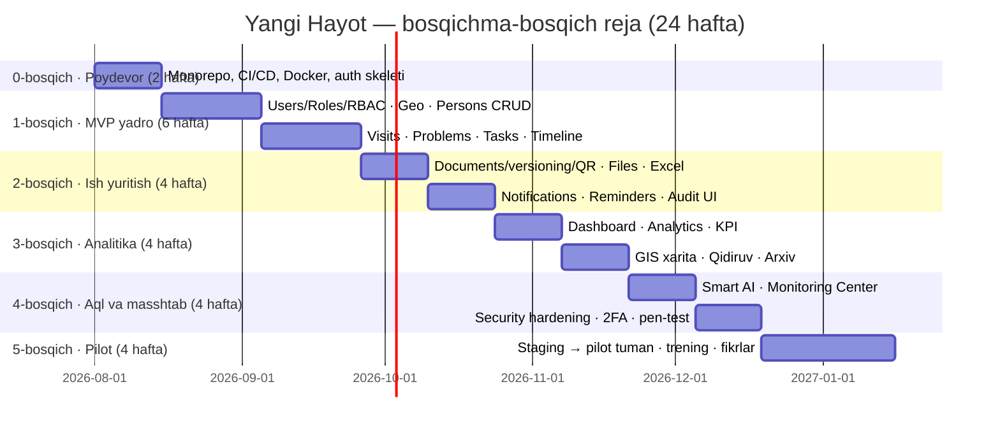

# 08 — Coding Standards, Enterprise Best Practices & Roadmap

---

## 1. Coding Standards

### 1.1 Umumiy

| Qoida | Qiymat |
|---|---|
| Til | 100% TypeScript, `strict: true`, `any` taqiqlangan (`unknown` + narrowing) |
| Format | Prettier (yagona konfiguratsiya, pre-commit hook) |
| Lint | ESLint flat config (`packages/eslint-config`), CI'da xato = build fail |
| Nomlash | Fayllar `kebab-case.ts` · klasslar `PascalCase` · funksiyalar/o'zgaruvchilar `camelCase` · DB jadval/ustunlar `snake_case` (Prisma `@@map`) · konstantalar `SCREAMING_SNAKE` |
| Kod tili | Identifikatorlar inglizcha; UI matnlari i18n lug'atda (uz-latin asosiy) |
| Import tartibi | node → tashqi → `@yangi-hayot/*` → nisbiy (eslint-plugin-import) |
| Magic values | Taqiqlangan — `packages/shared` dagi enum/konstantalar |

### 1.2 Git va ko'rib chiqish

- **Branch:** `main` (himoyalangan) ← `develop` ← `feature/YH-123-qisqa-nom`.
- **Commit:** Conventional Commits (`feat:`, `fix:`, `refactor:`, `docs:`...).
- **PR:** kichik (≤400 qator diff maqsad), kamida 1 review, CI yashil bo'lmaguncha merge yo'q.
- **Squash merge** — chiziqli tarix.

### 1.3 Testlar

| Daraja | Vosita | Qamrov maqsadi |
|---|---|---|
| Unit (service/util) | Jest | Biznes logika, risk engine, scope filter — ≥80% |
| Integration (API e2e) | Jest + Supertest + test DB | Har endpoint: muvaffaqiyat + 401/403 (scope buzilishi!) + validatsiya |
| Frontend | Vitest + Testing Library | Muhim formalar, permission-render |
| E2E smoke | Playwright | Login→shaxs yaratish→topshiriq→tasdiqlash asosiy oqimi |

**Majburiy:** har permission/scope qoidasi uchun rad etish (403) testi — xavfsizlik regressiyasiga qarshi asosiy himoya.

### 1.4 API/DB standartlari

- DTO'siz endpoint yo'q; javob envelope'siz endpoint yo'q.
- Har migratsiya reversible yoki aniq hujjatlangan; migratsiyada ma'lumot yo'qotish taqiqlangan (soft delete).
- N+1 taqiqlangan — `include`/`select` ongli ravishda; ro'yxatlarda faqat kerakli ustunlar.
- Har yangi jadval: `createdAt`, `updatedAt`, `deletedAt` (lug'atlardan tashqari), scope ustunlari indeksli.

## 2. Enterprise Best Practices (loyihaga tatbiqi)

| Amaliyot | Tatbiq |
|---|---|
| 12-Factor | Konfiguratsiya env orqali, stateless API, loglar stdout (JSON) |
| Fail-safe defaults | Permission topilmasa — rad; scope aniqlanmasa — bo'sh natija (hech qachon "hammasi") |
| Idempotency | Import/notification joblari idempotent; retry xavfsiz |
| Graceful degradation | Redis o'chsa — sekinroq lekin ishlaydi; Telegram o'chsa — in-app qoladi; WS o'chsa — polling |
| Zero-downtime deploy | Rolling restart, backward-compatible migratsiyalar (expand→migrate→contract) |
| Data retention | Audit 5 yil, sessiyalar 90 kun, notification 1 yil — sozlanadigan siyosat |
| Hujjatlashtirish | ADR (Architecture Decision Records) `docs/adr/` da; Swagger doim dolzarb (koddan generatsiya) |
| Onboarding | `README` + `make dev` bilan bitta buyruqda lokal muhit (docker compose) |

## 3. Loyiha Roadmap

### Bosqich natijalari (Definition of Done)

| Bosqich | Yakuniy natija |
|---|---|
| **0 — Poydevor** | `make dev` ishlaydi; CI (lint+test+build) yashil; login/refresh/logout; seed rollar |
| **1 — MVP yadro** | Operator shaxs kiritadi, prokuror tashrif/muammo qayd etadi, rahbar topshiriq beradi va tasdiqlaydi; scope to'liq ishlaydi; timeline to'ladi |
| **2 — Ish yuritish** | Hujjat versiyalari + QR tekshiruv; Excel import (dublikat aniqlash bilan) va export; Telegram bildirishnomalar; audit sahifasi |
| **3 — Analitika** | Real-time dashboard (WS); ECharts to'plami; KPI reyting; Yandex Maps (marker/heatmap/radius); advanced qidiruv; arxiv |
| **4 — Aql va masshtab** | AI so'rov shablonlari + risk engine + hisobot generatsiya; Monitoring Center; 2FA majburiy (rahbarlar); tashqi xavfsizlik auditi o'tdi |
| **5 — Pilot** | Pilot tumanda jonli ishlash; xodimlar treningdan o'tgan; fikrlar asosida tuzatishlar; production runbook tayyor |

### Kengaytirish (pilotdan keyin)

1. Viloyatning barcha tumanlari → viloyatlar → respublika (arxitektura o'zgarmaydi — scope modeli shunga qurilgan).
2. PostgreSQL replica + API replikatsiya + Kubernetes (01-hujjat, 5.2).
3. Integratsiyalar (roadmap): davlat reestrlari, ID tizimlari — alohida kelishuv asosida.

## 4. Xavflar reestri

| Xavf | Ehtimol | Ta'sir | Chora |
|---|---|---|---|
| Talablar o'zgarishi (davlat idorasi) | Yuqori | O'rta | Modulli arxitektura, bosqichli demo, har bosqichda rahbariyat tasdig'i |
| Ichki tarmoq cheklovlari (tashqi API'larga chiqish) | O'rta | Yuqori | Telegram/SMS/LLM uchun proxy rejimi; barcha tashqi kanal ixtiyoriy, in-app doim ishlaydi |
| Katta hajmli import sifatsiz ma'lumot | Yuqori | O'rta | Qattiq validatsiya, dublikat aniqlash, xato hisoboti, tranzaksion import |
| Xodimlar ko'nikmasi | O'rta | O'rta | Sodda UI, trening, rol-ga mos minimal interfeys |
| Server resurslari (davlat DC) | O'rta | O'rta | Yengil stack (compose), monitoring, kapasitet rejasi |
